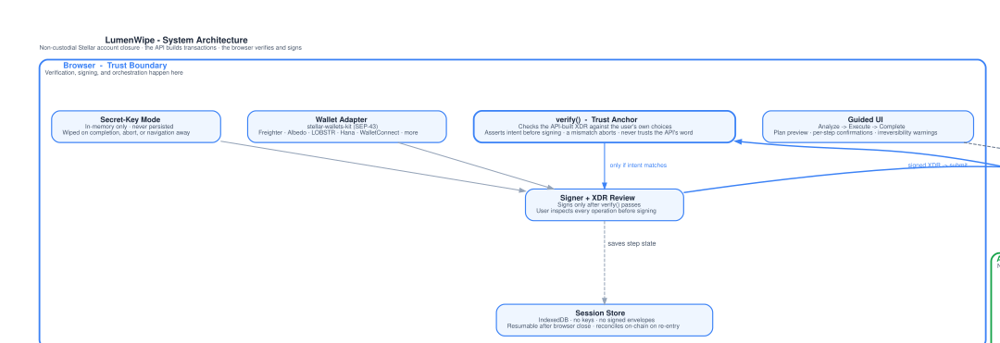
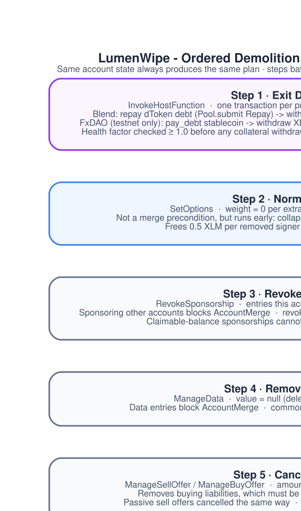
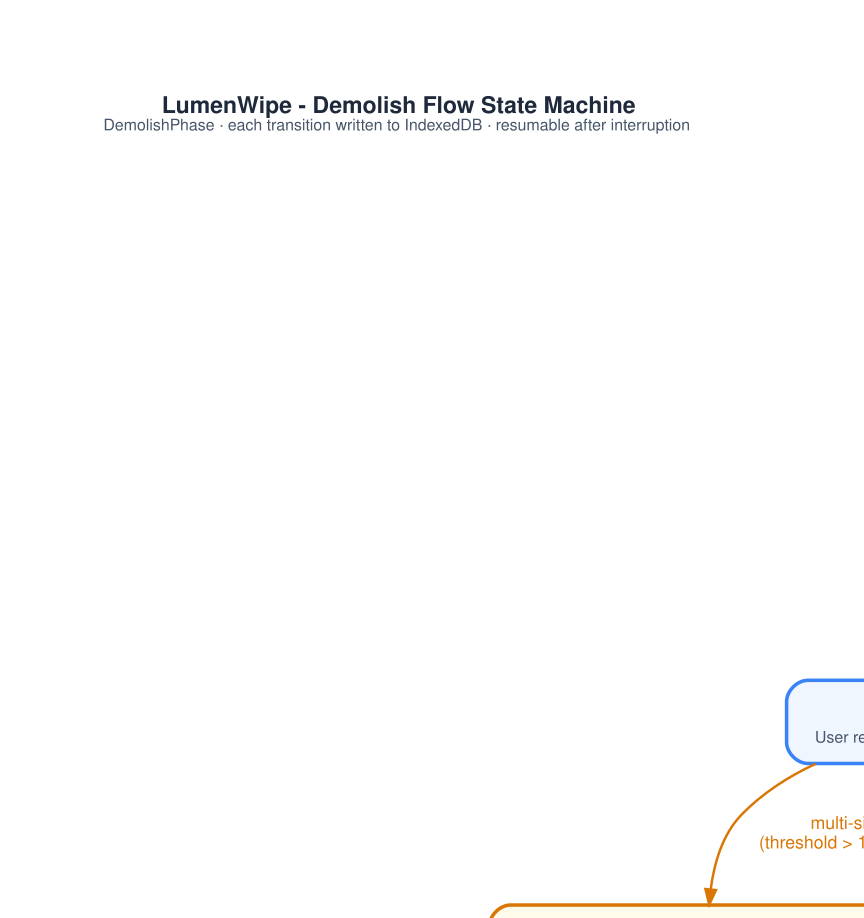
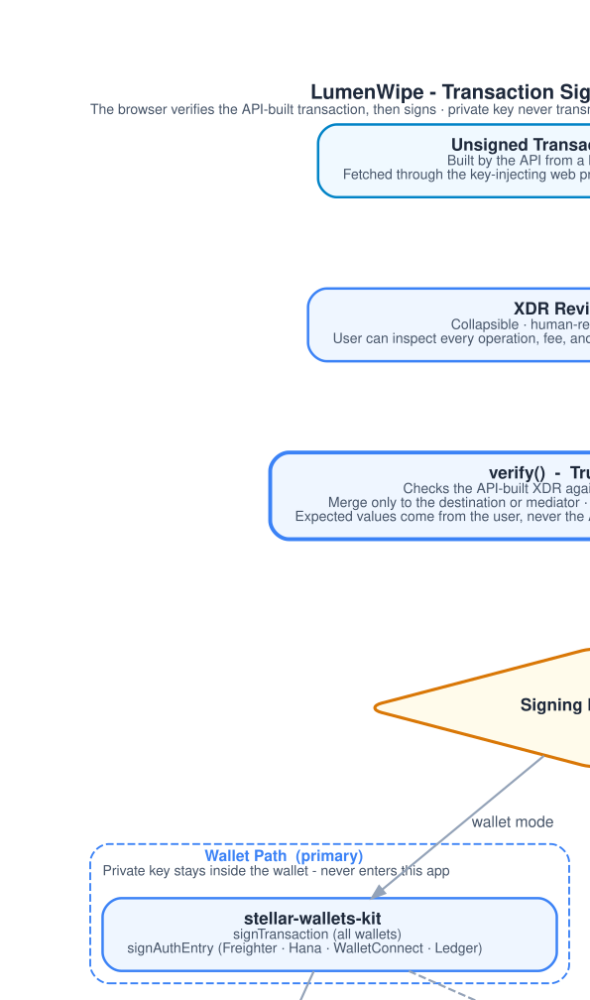
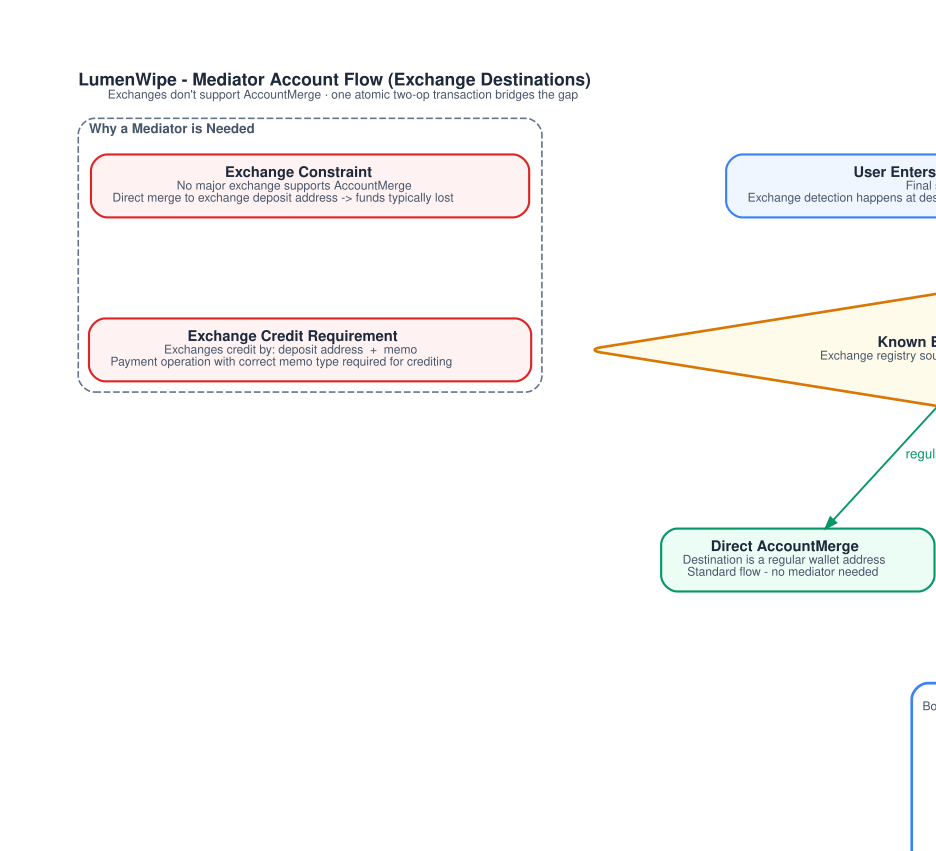
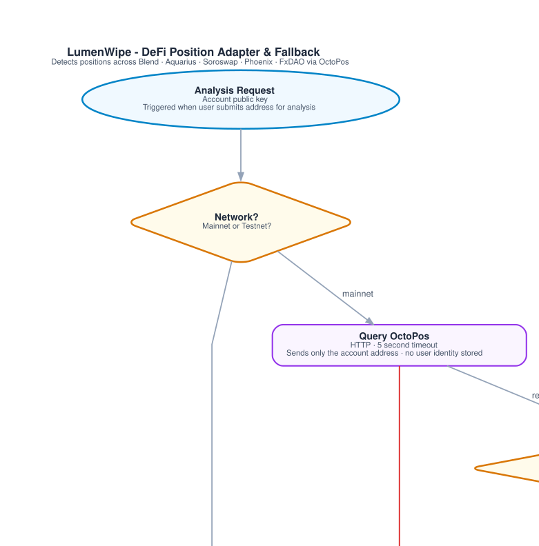
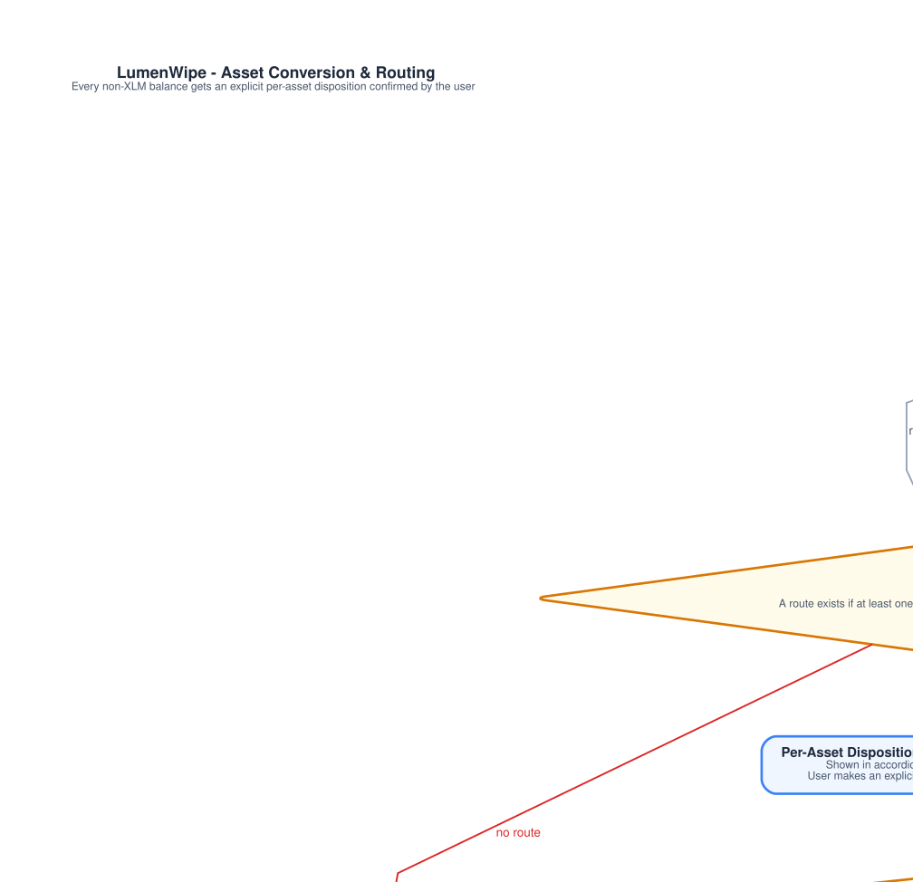

<div align="center">
  <br /><br />

# LumenWipe

**Close any Stellar account cleanly and recover your locked XLM.**

Non-custodial &nbsp;·&nbsp; Client-side signing &nbsp;·&nbsp; Soroban & DeFi support &nbsp;·&nbsp; Open source

[](https://lumenwipe.com)
[](https://docs.lumenwipe.com)
[](https://stellar.org)
[](LICENSE)

</div>

---

## What is LumenWipe?

LumenWipe is an open-source, non-custodial web app that walks you through closing a Stellar account from start to finish - automatically. It detects everything holding your account open (trustlines, DEX offers, DeFi positions, data entries, extra signers), unwinds it step by step, converts leftover tokens to XLM, and merges the account into your destination wallet or exchange address.

**The API builds every unsigned transaction; the browser verifies it against your own choices and signs it. Your private keys never leave your device.** The API holds no user keys and can never move your funds.

> **Status:** the classic account wind-down runs today on testnet and mainnet. Soroban & DeFi protocol exits, the allowance inspector, and sponsored fees are in active development - see the [roadmap](#delivery-roadmap). Exchange (mediator) closes and sponsored fees are available on testnet; mainnet availability follows the deployment status in the [monitoring plan](docs/monitoring-plan.md). FxDAO exits are testnet only.

---

## The Problem

Stellar has over **10 million accounts on mainnet**, and a large share are stale, abandoned, or locked. Two structural issues cause this:

**1. Every account locks XLM in reserve.** The minimum balance is 1 XLM (two base reserves of 0.5 XLM), and each trustline, open offer, data entry, or extra signer adds another 0.5 XLM. An account with four trustlines, two offers, one data entry, and one extra signer locks **5 XLM** that cannot be spent until each entry is individually removed.

**2. Closing an account manually is hard.** A single leftover subentry causes the final `ACCOUNT_MERGE` to fail. Users must cancel every offer, exit every DeFi position, sell every asset, remove every trustline, and clear every data entry - in the correct order - before the merge succeeds. Miss one and everything reverts.

**Exchanges compound the problem.** No major exchange supports `ACCOUNT_MERGE`. Sending remaining XLM to a CEX deposit address still leaves the 1 XLM minimum balance permanently locked. LumenWipe solves this with a shared mediator account and an atomic forwarding payment.

**DeFi users have no tool at all.** The existing demolisher has no Soroban support. Any account with a Blend loan, an Aquarius LP position, or a Soroswap pair share cannot be closed with existing tools.

---

## Architecture

The system has three layers. The trust boundary is the browser: it verifies every transaction and signs it; keys never leave the client.



**Browser (trust boundary)** - The guided UI, wallet adapter, and `verify()` (the trust anchor) live in the browser. It fetches unsigned transactions from the API through a key-injecting server-side proxy, verifies each one against the user's own choices before signing, signs locally, and submits back through the API. After the user confirms the plan, the session is persisted to IndexedDB; keys are never stored.

**API service** - A stateless NestJS service, and the product itself: it reads account state, detects DeFi positions, quotes routes, and builds the minimal set of unsigned transactions that close an account. It holds no user keys and is not in the signing path; its two signing keys co-sign only the mediator's forward payment and pay fee-bump network fees. A fully compromised API still cannot move funds, because `verify()` refuses to sign anything that does not match the user's intent.

**Stellar network and data services** - The sources and what each is used for are described once in [architecture section 5](docs/architecture.md#5-data-sources-and-why-we-run-no-indexer).

**Key design decisions:**

- **No bespoke indexer.** Stellar RPC cannot enumerate unknown subentries, so enumeration comes from an existing provider set by configuration. LumenWipe re-reads exact on-chain state over RPC immediately before building each transaction, and never signs based on stale data.
- **Pluggable data sources.** Every read source (RPC provider, indexer, routing API, DeFi position API) is behind an adapter, so any compatible provider can be swapped in without touching the transaction logic.
- **Soroban exits are simulated before signing.** Every `InvokeHostFunction` is run through `simulateTransaction` to fill in footprint, authorization, and resource fees. The user sees the simulation result before being asked to sign.

---

## How It Works

### Execution plan

LumenWipe builds a **deterministic, ordered execution plan** from the account's live state. The same account state always produces the same plan - which makes it auditable and unit-testable. Each round is reconciled against live on-chain state, so a resumed close never double-executes a completed step. See [how closing works](docs/guides/how-closing-works.mdx#interruptions-are-safe) for when a session can resume.



| Step                            | Operation                               | Details                                                                                                           |
| ------------------------------- | --------------------------------------- | ----------------------------------------------------------------------------------------------------------------- |
| **1. Exit DeFi positions**      | Soroban `InvokeHostFunction`            | Blend, Aquarius, Soroswap, Phoenix (unbond), FxDAO (testnet only): each exit is its own transaction, run first    |
| **2. Normalize signers**        | `SetOptions`                            | Removes extra signers, normalizes thresholds to 0/1/1 so a single key can authorize all remaining steps           |
| **3. Revoke sponsorships**      | `RevokeSponsorship`                     | Revokes sponsorships this account provides when the owner can absorb the reserve; the rest surface as blockers    |
| **4. Remove data entries**      | `ManageData`                            | Clears all `ManageData` entries in batches of 100                                                                 |
| **5. Cancel DEX offers**        | `ManageSellOffer` / `ManageBuyOffer`    | Sets amount to 0 on all open order-book offers, freeing reserves                                                  |
| **6. Claim claimable balances** | `ClaimClaimableBalance`                 | Claims balances the account can claim before conversion; adds a trustline first when the user chooses that remedy |
| **7. Handle each asset**        | `PathPaymentStrictSend` / Soroban swaps | Each non-XLM balance is converted to XLM, transferred, or returned to its issuer, as the user chose               |
| **8. Remove trustlines**        | `ChangeTrust` (limit 0)                 | Removes all trustlines once their balances are zero, batched by 100                                               |
| **9. Merge account**            | `AccountMerge`                          | Direct merge, or via mediator account for exchange destinations                                                   |

Liquidity pool shares are not unwound by LumenWipe: an account that holds them is reported as a blocker, and the shares must be withdrawn elsewhere first.

### Session state machine

The entire wind-down is held as an explicit state machine persisted to IndexedDB. A resumable session exists only after the user confirms on the review page; the full rule is in [how closing works](docs/guides/how-closing-works.mdx#interruptions-are-safe).



### Signing flow

Every step follows the same pattern: the API builds the unsigned envelope → present for review → `verify()` against the user's intent → sign in browser → submit via the API → poll to confirmation → advance.



### CEX mediator flow

Exchanges don't support `ACCOUNT_MERGE`. LumenWipe routes the merge through a shared mediator account in a single atomic transaction sequence:



The mediator is a persistent account funded once by the operator and reused for every close. You recover essentially all of your XLM; only standard network fees apply. The API builds the transaction, `verify()` confirms the merge goes to the shared mediator, and your browser signs the merge half. The API co-signs only the mediator's forward payment, after validating the exact transaction shape, and cannot alter the destination or amount. Known exchange destinations are validated against a registry that enforces the correct memo type - a missing memo blocks submission.

Availability by network (as of 2026-10-10): the mediator flow is available on testnet; mainnet availability follows the deployment status in the [monitoring plan](docs/monitoring-plan.md).

---

## Supported DeFi Protocols

LumenWipe detects and unwinds positions across the major Soroban DeFi protocols using [OctoPos](https://communityfund.stellar.org/project/octopos-defi-position-api-g6i) as the DeFi Position API.



| Protocol        | Position type                               | Exit mechanism                                                      |
| --------------- | ------------------------------------------- | ------------------------------------------------------------------- |
| **Classic DEX** | Order-book offers                           | `ManageSellOffer` / `ManageBuyOffer` (amount = 0)                   |
| **Classic AMM** | Pool-share trustline (CAP-38)               | Not unwound: reported as a blocker, withdraw the shares elsewhere   |
| **Blend**       | Supply (bToken), borrow (dToken), backstop  | `Pool.submit` - repay then withdraw, via `@blend-capital/blend-sdk` |
| **Aquarius**    | AMM LP, AQUA rewards                        | `withdraw`, `claim` via Aquarius contracts                          |
| **Soroswap**    | AMM LP                                      | `remove_liquidity` via Soroswap Router API                          |
| **Phoenix**     | AMM LP, optional stake                      | `withdraw_liquidity`, `unbond` first if staked                      |
| **FxDAO**       | CDP vault (XLM collateral, stablecoin debt) | `pay_debt` then collateral withdrawal (testnet only, see below)     |

FxDAO has stopped operating on mainnet, so its exit is testnet only and a mainnet FxDAO position is reported as a blocker.

If the DeFi position provider is unavailable, the tool enters **degraded mode**: classic entries process normally and the user is warned to verify DeFi positions manually. The flow never silently fails or skips a position.

### Asset conversion routing



All non-XLM balances are converted using the best available route: the Soroswap Aggregator API (which spans both Soroban AMMs and the classic SDEX), with SDEX path payments as the fallback. Every conversion is quoted, slippage-bounded, and simulated before the user is asked to sign.

---

## Security Model

LumenWipe builds transactions that drain accounts irreversibly. The security design starts from that fact.

| What                      | How it's protected                                                                                                                                         |
| ------------------------- | ---------------------------------------------------------------------------------------------------------------------------------------------------------- |
| **Private key**           | Never transmitted. Wallet path keeps it in the wallet; advanced secret-key mode keeps it in memory only, cleared after each signing operation              |
| **API-built transaction** | Verified client-side against the user's own choices before signing (`verify()`); the browser never signs bytes it did not verify                           |
| **Destination address**   | Full-address display, ledger existence check, and explicit confirmation before merge                                                                       |
| **Exchange memo**         | Required and validated for known exchange destinations - missing memos block submission                                                                    |
| **API compromise**        | Cannot move funds: `verify()` checks every transaction against the user's own inputs, never the API's response, so a diverting transaction is never signed |
| **XSS**                   | Strict Content Security Policy - no inline scripts, no `unsafe-eval`                                                                                       |
| **Supply chain**          | Lockfile-pinned dependencies, audited in CI                                                                                                                |

The codebase undergoes internal security reviews as part of the development process. External security audits will be conducted when possible.

---

## Technology Stack

| Layer          | Choice                                              | Why                                                                                    |
| -------------- | --------------------------------------------------- | -------------------------------------------------------------------------------------- |
| Web client     | Next.js, TypeScript                                 | Thin open-source client: verifies (`verify()`) and signs, no transaction-building      |
| API            | NestJS, TypeScript, cache                           | Builds transactions; stateless; own deployable, reached via a key-injecting proxy      |
| Packaging      | Bun workspaces monorepo                             | `apps/{web,api}` + `packages/{sdk,types}`; `@lumenwipe/sdk` is a thin API fetch client |
| Stellar SDK    | `@stellar/stellar-sdk`                              | Official SDK for classic and Soroban                                                   |
| Wallets        | `stellar-wallets-kit` (SEP-43)                      | One interface across Freighter, xBull, Albedo, LOBSTR, Hana, WalletConnect, and more   |
| Network access | Stellar RPC                                         | Live reads, simulation, submission, events                                             |
| Enumeration    | Existing indexer, set by configuration              | See architecture section 5                                                             |
| Routing        | Soroswap API + SDEX paths                           | Best routes across Soroban and classic venues                                          |
| DeFi detection | OctoPos                                             | Funded DeFi Position API, behind a pluggable adapter                                   |
| State          | Zustand + IndexedDB                                 | Resumable sessions, never persists keys                                                |
| Testing        | Bun test runner (unit), Playwright (E2E on testnet) | Automated tests do not use mainnet; per-package CI across the monorepo                 |

---

## Quick Start

**Requirements:** [Bun](https://bun.sh) 1.3+

```bash
# Clone and install
git clone https://github.com/LumenWipe/lumenwipe.git
cd lumenwipe
bun install

# Run in development (testnet by default) - the full flow needs BOTH services
bun run dev:api      # NestJS API (localhost:3001)
bun dev              # web (localhost:3000), reaches the API through its proxy
```

Open [http://localhost:3000](http://localhost:3000). The tool defaults to Stellar testnet - no real funds are at risk while developing.

### Environment variables

The web and the API each read their own `.env.local` (copy from each app's `.env.example`).

**`apps/api/.env.local`** - the API:

| Variable                                   | Description                                                                   |
| ------------------------------------------ | ----------------------------------------------------------------------------- |
| `API_KEYS`                                 | Accepted API keys as `label=key` (the web's key must be listed here)          |
| `STELLAR_RPC_TESTNET` / `_MAINNET`         | Stellar RPC endpoints                                                         |
| `PATH_ROUTING_API_TESTNET` / `_MAINNET`    | Horizon-compatible endpoints for offers, full account state, and path finding |
| `MEDIATOR_PUBLIC_*` / `MEDIATOR_SECRET_*`  | Shared mediator keys (operator-only; enables exchange closes)                 |
| `ADMIN_API_TOKEN` / `FIRESTORE_PROJECT_ID` | Optional; enables self-serve API key management (`/admin/api-keys`, #289)     |

**`apps/web/.env.local`** - the web:

| Variable                                              | Description                                                                         |
| ----------------------------------------------------- | ----------------------------------------------------------------------------------- |
| `LUMENWIPE_API_URL` / `LUMENWIPE_API_KEY`             | API base URL and key, injected server-side by the proxy (never sent to the browser) |
| `UPSTASH_REDIS_REST_URL` / `UPSTASH_REDIS_REST_TOKEN` | Upstash Redis - for the proxy rate limit                                            |

### Running tests

```bash
# Unit tests
bun run test

# End-to-end tests (Playwright, against testnet)
bun run test:e2e

# Type check
bun run type-check
```

---

## Documentation

Full technical documentation is at [**docs.lumenwipe.com**](https://docs.lumenwipe.com).

| Document                                                           | Description                                                                                                                     |
| ------------------------------------------------------------------ | ------------------------------------------------------------------------------------------------------------------------------- |
| [Executive Summary](docs/executive-summary.md)                     | One-page overview: problem, solution, technical pillars, and delivery plan                                                      |
| [Technical Architecture](docs/architecture.md)                     | Complete system design: data sources, execution plan, Soroban & DeFi integration, mediator flow, security, testing, and roadmap |
| [Community & Communications](docs/community-and-communications.md) | Building in the open, update cadence, decentralized social channels, and post-launch maintenance                                |
| [Diagram sources](diagrams/)                                       | All 9 diagrams: Python/Graphviz generator, Mermaid context copies, rendered PNG/SVG exports                                     |

---

## Delivery Roadmap

The project is delivered in three cumulative phases, each independently verifiable:

| Phase                              | Focus                                                                                                                                                                                                                             | Status          |
| ---------------------------------- | --------------------------------------------------------------------------------------------------------------------------------------------------------------------------------------------------------------------------------- | --------------- |
| **Phase 1 - Classic wind-down**    | Full classic wind-down on testnet: signer normalization, data entries, offer cancellation, classic liquidity pool withdrawal, asset conversion, trustline removal, merge, mediator flow, multisig, session recovery               | **In progress** |
| **Phase 2 - Soroban & DeFi**       | DeFi position detection via OctoPos; Blend, Aquarius, Soroswap, Phoenix, and FxDAO (testnet only) exits; Soroban token conversion; allowance inspector; per-step simulation; sponsored fees for reserve-locked accounts (testnet) | Planned         |
| **Phase 3 - Production hardening** | Security review and remediation, performance validation, final UX from user testing, complete public documentation, public REST API and TypeScript SDK for integrators                                                            | Planned         |

> The classic wind-down already runs. The API builds the classic transactions, the browser verifies and signs them, and the tool executes the full path - signer normalization, offer cancellation, asset conversion, trustline removal, and `AccountMerge` - on both testnet and mainnet. The mediator flow for exchange destinations is available on testnet.

---

## Community & Contributing

LumenWipe is open source from day one. The full API, web client, SDK, contract registry, and test suite are public.

| Channel                                                                     | Use                                                  |
| --------------------------------------------------------------------------- | ---------------------------------------------------- |
| [GitHub Issues](https://github.com/LumenWipe/lumenwipe/issues)              | Bug reports, feature requests, roadmap               |
| [LumenWipe Discord](https://discord.gg/hDCNaW6xn)                           | Community chat, support, and project discussion      |
| [Matrix - #lumenwipe:matrix.org](https://matrix.to/#/#lumenwipe:matrix.org) | Project discussion (open, decentralized)             |
| [Telegram - t.me/lumenwipe](https://t.me/lumenwipe)                         | Real-time community chat, support, and announcements |

**Contributing:** open an issue or pull request. The contract and exchange registries (versioned JSON) are especially easy to contribute to - new exchange addresses and protocol contract versions are reviewed pull requests, not code changes.

---

## License

[Apache 2.0](LICENSE) - permissive, allows reuse, includes a patent grant.

This project builds upon the open-source work of [stellar.expert/demolisher/public](https://stellar.expert/demolisher/public) by Orbit Lens.

---

<div align="center">
  <sub>
    <a href="https://lumenwipe.com">lumenwipe.com</a> &nbsp;·&nbsp;
    <a href="https://docs.lumenwipe.com">docs.lumenwipe.com</a>
  </sub>
</div>
