# Reporte de QA — Epic #159: Conversión Soroban, Inspector de Allowances y Fees Patrocinadas

**Fecha:** 2026-09-08 (actualizado 2026-09-09 con las correcciones del PR #220 — capturas del inspector de allowances retomadas en vivo, ya corregidas)
**Rama:** `feature/phase-2`
**Metodología:** para cada feature, además de la batería de tests automatizados (unitarios + integración), se ejecutó el flujo real en el navegador contra testnet, usando cuentas y transacciones reales en cadena — no datos simulados. Cada resultado se verificó de forma independiente (vía Horizon y/o Stellar Expert), nunca solo confiando en lo que mostró la propia UI de LumenWipe.

---

## Estado general

| Issue | Título | Estado | PR | Evidencia en vivo |
|---|---|---|---|---|
| #162 | Allowance discovery | ✅ Cerrado | [#218](https://github.com/LumenWipe/lumenwipe/pull/218) | Sí — RPC real |
| #163 | Allowance inspector UI + revocación | ✅ Cerrado | [#219](https://github.com/LumenWipe/lumenwipe/pull/219) | Sí — transacción firmada real |
| #164 | Endpoint de fee-bump (CAP-15) | ✅ Cerrado | [#216](https://github.com/LumenWipe/lumenwipe/pull/216) | Sí — transacción firmada real |
| #165 | Fee-bump en el flujo guiado | ✅ Cerrado | [#217](https://github.com/LumenWipe/lumenwipe/pull/217) | Sí — transacción firmada real |
| #161 | Conversión de tokens Soroban | 🟡 Abierto a propósito | [#212](https://github.com/LumenWipe/lumenwipe/pull/212)/[#213](https://github.com/LumenWipe/lumenwipe/pull/213)/[#214](https://github.com/LumenWipe/lumenwipe/pull/214) | Parcial — ver sección propia |

4 de 5 piezas están mergeadas, cerradas, y confirmadas funcionando con transacciones reales en testnet. La quinta (#161) tiene el código mergeado y probado, pero decidiste explícitamente dejarla abierta hasta hacer vos mismo la prueba de aceptación en mainnet (ver la sección de #161 más abajo para el detalle).

---

## #162 — Allowance discovery (lectura)

**Qué hace:** dado un address, encuentra cada allowance SEP-41 activa que la cuenta haya otorgado, cruzando eventos `approve` (RPC `getEvents`) con el registro de contratos DeFi conocido, y confirmando cada candidato con una lectura real de `allowance()` en cadena.

**Endpoint:** `GET /:network/allowances/:address`

### Evidencia: consulta real contra testnet

Cuenta de prueba `GCB7MPRPX3Q4GJJY4CER3RBGTF4IRBMJ26DZAM635TLHOC53NJM7G5OI`, con una allowance real de 0.75 XTAR otorgada al pool de Blend en testnet (tx de aprobación: [`07b2b57a...d4170fa`](https://stellar.expert/explorer/testnet/tx/07b2b57a42cd655f773ed2b2e6eab48811d8dc2427895f772723e2093d4170fa)):

```json
{
  "allowances": [
    {
      "token": "CCZGLAUBDKJSQK72QOZHVU7CUWKW45OZWYWCLL27AEK74U2OIBK6LXF2",
      "tokenSymbol": "XTAR",
      "tokenDecimals": 7,
      "spender": "CCEBVDYM32YNYCVNRXQKDFFPISJJCV557CDZEIRBEE4NCV4KHPQ44HGF",
      "spenderProtocol": "blend",
      "amount": "7500000",
      "expirationLedger": 4575852,
      "sources": ["events", "registry"]
    }
  ],
  "coverage": [
    { "source": "events", "status": "ok" },
    { "source": "registry", "status": "ok" }
  ],
  "warnings": []
}
```

Nótese `"sources": ["events", "registry"]` — esta allowance se encontró por las dos vías a la vez (el evento `approve` real, y el cruce con el registro de contratos conocidos), confirmando que ambas rutas de descubrimiento funcionan.

**Cobertura de tests:** 18 tests unitarios (`apps/api/tests/unit/allowances.test.ts`) cubriendo el escaneo de eventos, el cruce con el registro, el manejo de spenders tipo cuenta (no solo contrato), el tope de candidatos, y los casos de falla parcial.

---

## #163 — Allowance inspector UI y revocación

**Qué hace:** una página independiente del flujo de cierre de cuenta (`/[network]/allowances`) donde cualquiera puede revisar y revocar sus propias allowances, sin necesidad de cerrar la cuenta.

**Nota:** las capturas 3-6 de esta sección se retomaron el 2026-09-09 con una allowance nueva, real, aprobada específicamente para esto (`GAGEBFJ5L5SAT25R5TKHF73APWHVQ6CW2MTBTSM24D6CXKNLIO76IFME`, 0.75 XTAR al pool de Blend — tx de aprobación [`7941a247...9e6ebe`](https://stellar.expert/explorer/testnet/tx/7941a247e68f77f8a1b5a2b70d8f59628da6ceba0171227b0413251e5f9e6ebe)), corriendo ya con la corrección del PR [#220](https://github.com/LumenWipe/lumenwipe/pull/220) — la versión anterior de estas capturas mostraba el botón "Revoke allowance" con el texto casi invisible (`warning`/`stellar` nunca se habían registrado como colores reales de Tailwind, así que su motor JIT no generaba ningún CSS para ellos, ni siquiera la clase base). Se corrigió registrándolos igual que el color `value`, que ya funcionaba bien.

### 1. Punto de entrada — visible desde la página principal, sin pasar por el wizard de cierre

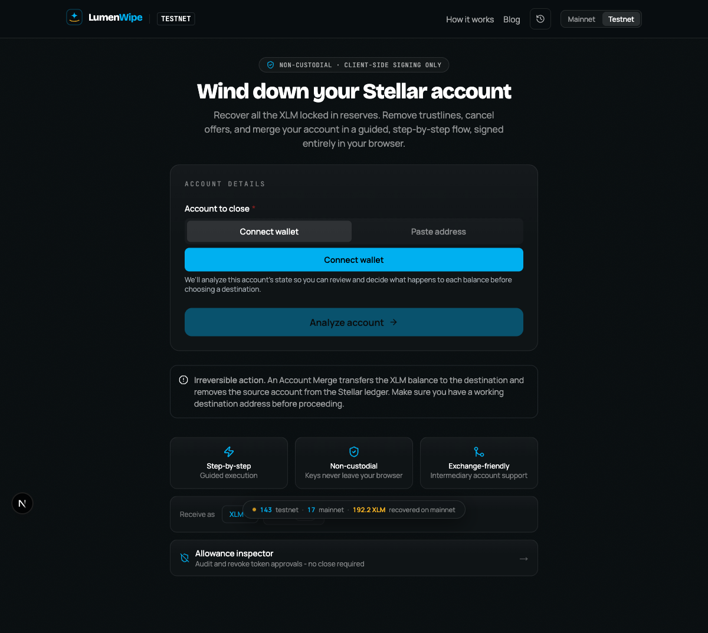

### 2. Búsqueda de cuenta

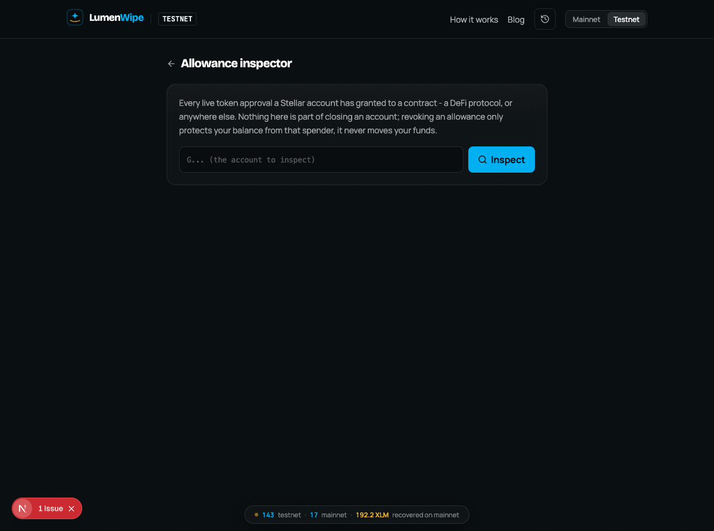

### 3. Allowance encontrada (0.75 XTAR aprobados al pool de Blend) — badge "Revoke" en ámbar, legible

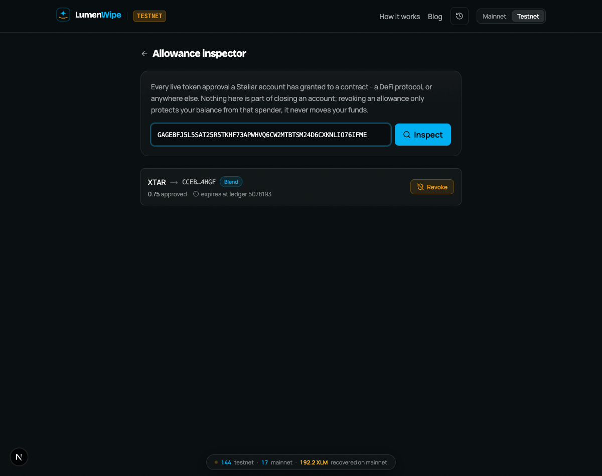

### 4. Modal de confirmación de revocación

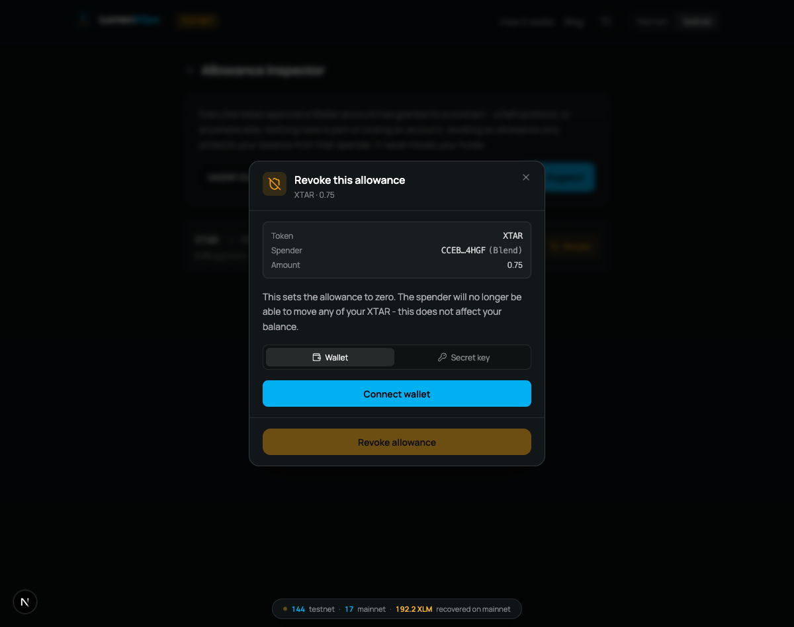

### 5. Firma con llave secreta (la llave nunca sale del navegador) — botón "Revoke allowance" en ámbar, texto negro legible

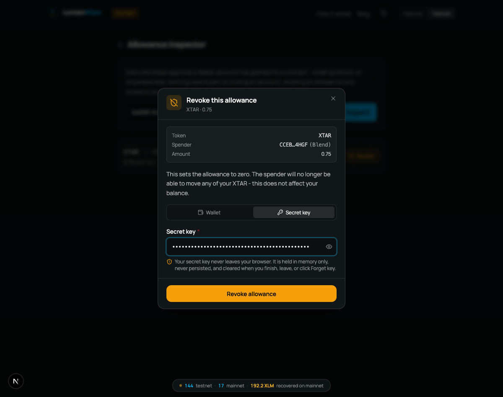

### 6. Revocación exitosa — confirmada en cadena

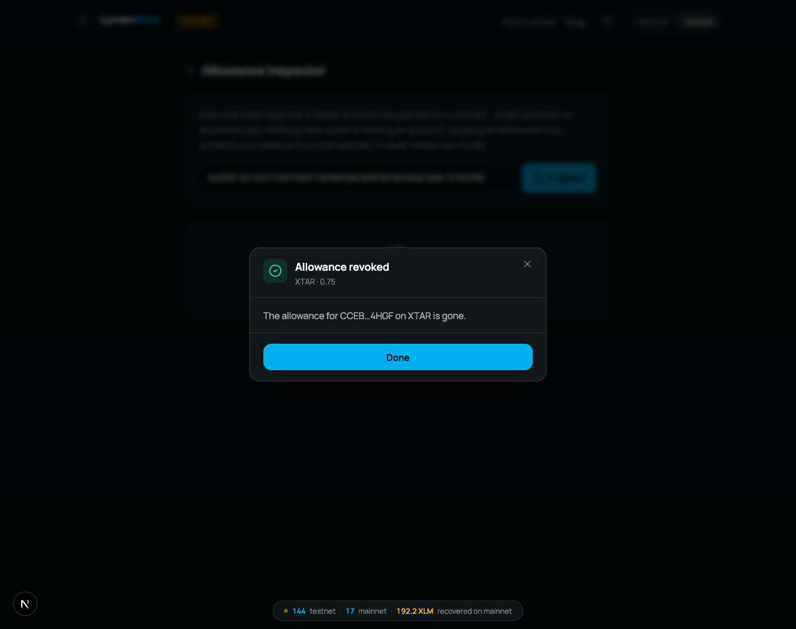

### Evidencia independiente

Transacción de revocación real: [`0af4f436...d135858`](https://stellar.expert/explorer/testnet/tx/0af4f4361b368dbf3d8cd157ffa6e9cc701087782aef8290f0a3c7616d135858) — confirmada exitosa vía Horizon (`successful: true`, cuenta `GAGEBFJ5...76IFME`, 1 operación).

Verificación independiente (no vía la UI de LumenWipe, sino una consulta directa a la API después de cerrar el modal):

```json
{ "allowances": [], "coverage": [{ "source": "events", "status": "ok" }, { "source": "registry", "status": "ok" }], "warnings": [] }
```

La allowance quedó genuinamente en cero on-chain, no solo removida de la pantalla.

**Cobertura de tests:** 24 tests (verificador de firma, modal de revocación con un flujo completo real de construir→verificar→firmar→enviar, y el listado). La revisión adversarial de 3 agentes encontró y corrigió 2 bugs reales antes de mergear: un caso donde revocaciones legítimas con spender tipo cuenta se rechazaban siempre, y un tope de fee faltante en el verificador del navegador.

---

## #164 y #165 — Fees patrocinadas (CAP-15) para cuentas en su reserva mínima

**Qué hace:** cuando una cuenta está exactamente en su reserva mínima (sin saldo disponible ni para pagar la fee de su propio cierre), la API detecta esto, marca esa transacción con fee cero, y el navegador la envía a un endpoint que la envuelve en un sobre de fee-bump (CAP-15) pagado por una cuenta patrocinadora dedicada — el usuario nunca necesita fondos extra para poder cerrar su cuenta.

### Prueba: cuenta drenada exactamente a 1.0000000 XLM (su reserva base, sin margen)

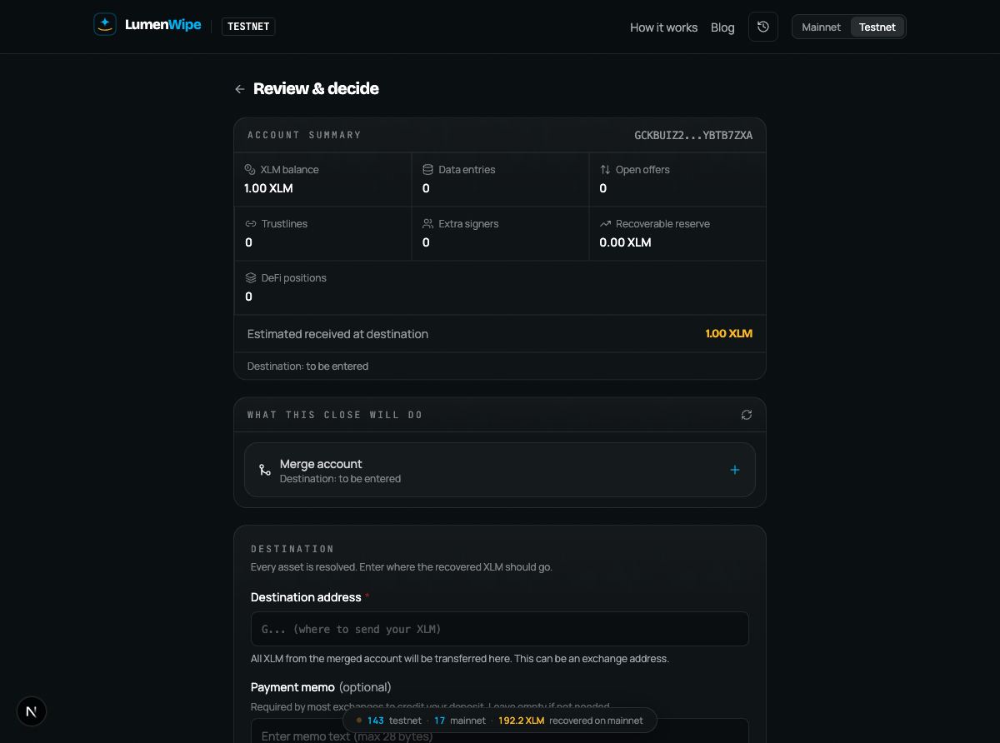

### Plan completo antes de firmar

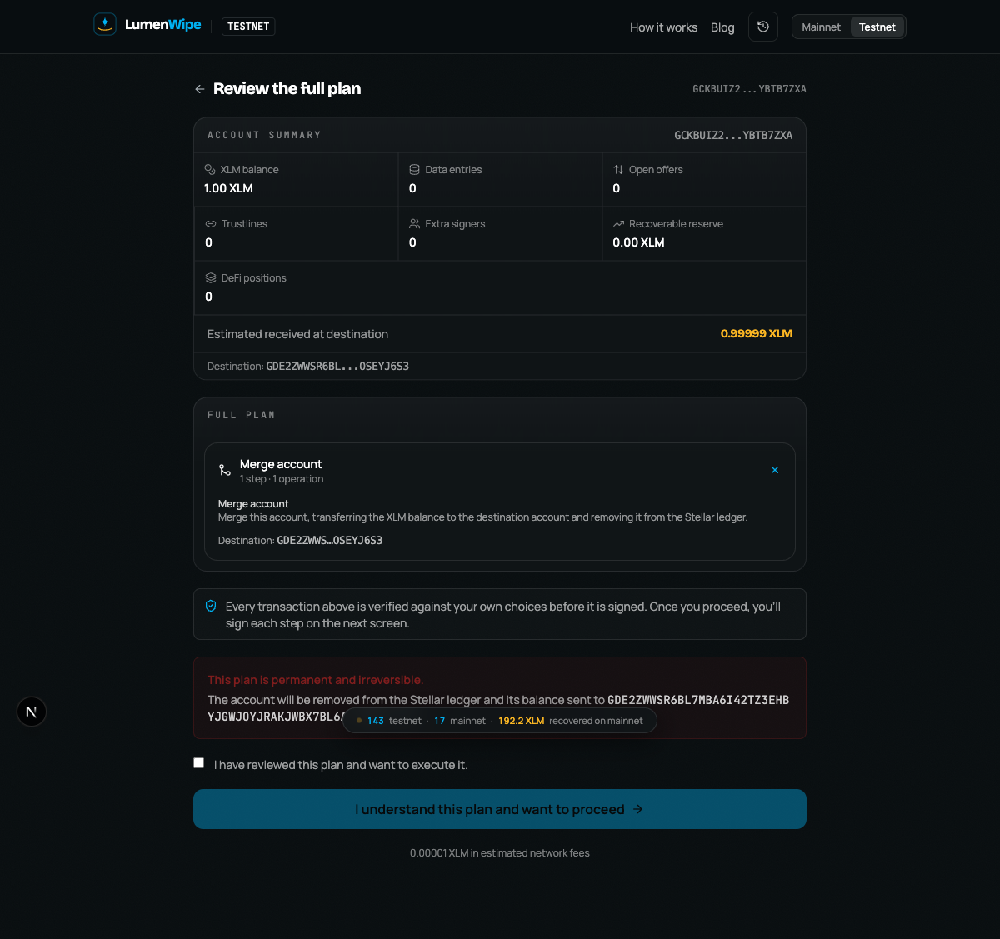

### Firma con llave secreta

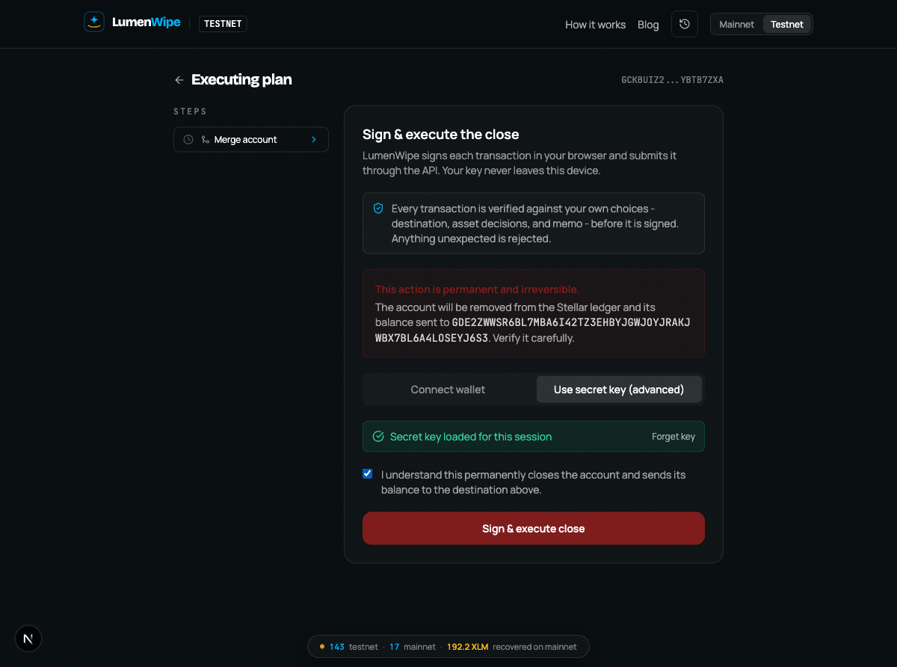

### En progreso (solicitando la fee patrocinada y enviando a la red)

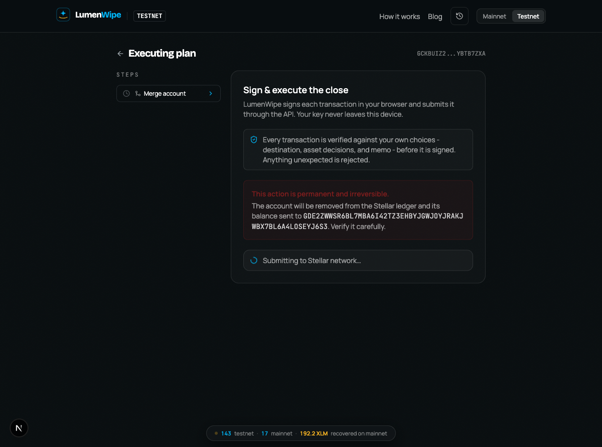

### Cuenta cerrada exitosamente — a pesar de no tener saldo disponible para su propia fee

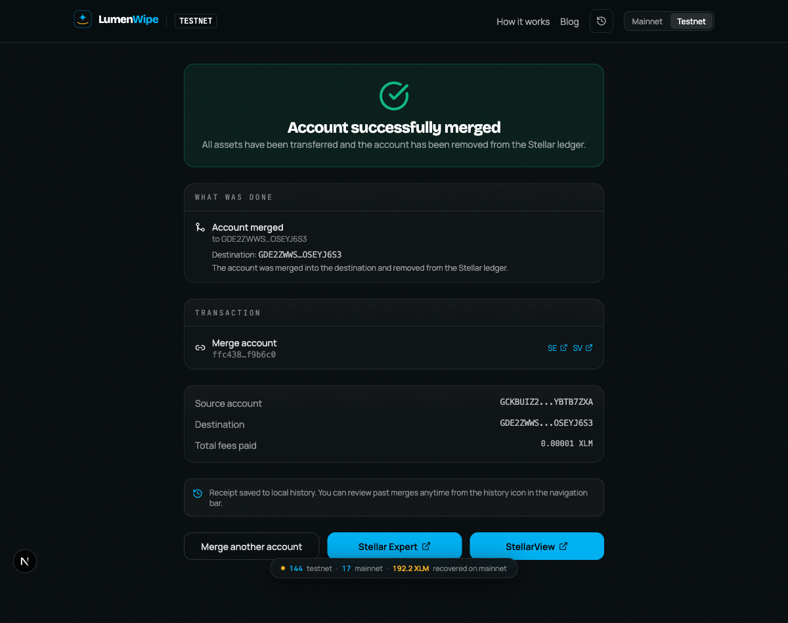

### Evidencia independiente — la fee la pagó la cuenta patrocinadora, no la cuenta cerrada

Esto es lo más importante de verificar: que la fee realmente la haya pagado la cuenta patrocinadora dedicada (`GCMCGC6EJZKJJUTFY6RK43PGOODW6EL6FSHSLXBV4EYSZ3GHNJO3FXAP`), no la cuenta que se estaba cerrando. Se confirmó por dos vías independientes, ninguna de las dos parte de LumenWipe:

**Vía Horizon (API pública de Stellar):**

```json
{
  "hash": "ffc4383ea6b8480ce20e6fd5480c66132bce351df0ec9cf119e58a01fcf9b6c0",
  "source_account": "GCKBUIZ2AWIOFEVBPP3ISQ6WXJAJCYJAR3NNQ7F4MZAGXQ3OYBTB7ZXA",
  "fee_account": "GCMCGC6EJZKJJUTFY6RK43PGOODW6EL6FSHSLXBV4EYSZ3GHNJO3FXAP",
  "fee_charged": 200,
  "successful": true
}
```

`source_account` (quien se cierra) y `fee_account` (quien paga) son cuentas **distintas** — así se ve una transacción CAP-15 fee-bump genuina, no una simulación.

**Vía Stellar Expert (explorador público, capturado en pantalla):**

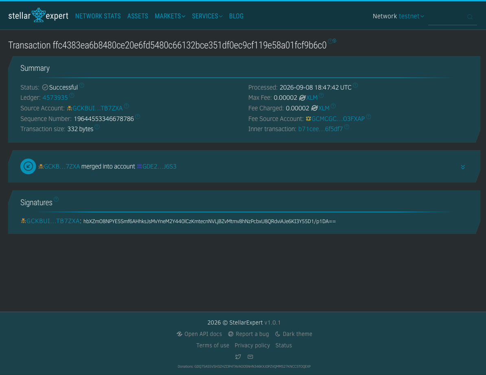

Stellar Expert etiqueta explícitamente el campo `Fee Source Account` como la cuenta patrocinadora, y muestra la transacción interna por separado — confirmando de forma visual e independiente que el mecanismo es real.

**Confirmación final:** la cuenta cerrada (`GCKBUIZ2...B7ZXA`) ya no existe en el ledger (`404 Resource Missing` al consultarla en Horizon) — el `AccountMerge` se ejecutó de verdad, de forma permanente.

Esta misma prueba se repitió dos veces en esta sesión con cuentas distintas (ver también la transacción [`c80597e7...2996412`](https://stellar.expert/explorer/testnet/tx/c80597e7dba37eb91677888a94e19bf2c94982e2302671e1ef20faafb2996412) de una corrida anterior), con idéntico resultado.

**Cobertura de tests:** suite completa de la API (1073 tests) más los tests específicos de `sponsored-fee.test.ts`, `revoke-allowance.test.ts`, y el hook `useCloseExecution` del lado web. Revisión adversarial de 3 agentes en cada PR, con hallazgos reales corregidos antes de mergear (ver el detalle en los PRs #216/#217).

---

## #161 — Conversión de tokens Soroban vía Soroswap (issue dejado abierto a propósito)

**Qué se implementó:** durante la disposición de cada balance de un token Soroban al cerrar una cuenta, el usuario puede elegir convertirlo a XLM a través del agregador de Soroswap, con un piso de conversión (`floor`) que el propio navegador verifica antes de firmar — nunca confía en la cotización de la API a ciegas.

**Código:** PRs [#212](https://github.com/LumenWipe/lumenwipe/pull/212) (discovery), [#213](https://github.com/LumenWipe/lumenwipe/pull/213) (disposición), [#214](https://github.com/LumenWipe/lumenwipe/pull/214) (conversión) — los tres mergeados a `feature/phase-2`.

**Qué está probado:**
- Suite unitaria completa: cotización, matemática del piso de conversión, ~24 casos de rechazo de forma de transacción, la regla del verificador del navegador.
- Un test de integración de solo lectura contra **mainnet real** (`apps/api/tests/integration/soroswap-conversion.integration.test.ts`): pide una cotización real, deja que la API construya la transacción para un holder real, y verifica que esos bytes cumplen exactamente lo que el verificador exige — sin firmar ni enviar nada.

**Qué falta, y por qué el issue sigue abierto:** el propio PR #214 estableció como criterio de aceptación *"a low-value mainnet close is the acceptance test"* — es decir, una conversión real, firmada y enviada, en mainnet con dinero real. Esa prueba nunca se hizo: no había una cuenta de mainnet ni fondos disponibles para hacerla de forma autónoma, y mover valor real en mainnet no es algo que deba automatizarse sin tu presencia. Te pregunté explícitamente si cerrar el issue igual o dejarlo así, y elegiste dejarlo abierto hasta que vos mismo corras esa prueba.

No hay evidencia visual de este punto en este reporte por la misma razón — no se ejecutó.

---

## Correcciones posteriores a este reporte

Al revisar las capturas de este mismo reporte, señalaste dos problemas reales. El primero ya está corregido y **vuelto a comprobar con una captura en vivo** (ver sección #163 más arriba, capturas 3-6 — retomadas el 2026-09-09 con una allowance real nueva, ya con el fix aplicado). El segundo es una aclaración más un ajuste real que sí encontramos a partir de tu pregunta. Ambos quedaron en el PR [#220](https://github.com/LumenWipe/lumenwipe/pull/220) (mergeado a `feature/phase-2`, revisado adversarialmente antes de mergear):

### 1. Botón "Revoke allowance" con texto invisible

Las capturas originales de la sección #163 mostraban el botón inferior del modal con el texto casi negro sobre negro — prácticamente ilegible. La causa: `warning` y `stellar` nunca se habían registrado como colores reales de Tailwind, así que su motor JIT no generaba ningún CSS para ellos — ni siquiera la clase base `bg-warning`, no solo las variantes con opacidad (`bg-warning/15`, etc.). Se corrigió registrándolos igual que el color `value`, que ya funcionaba bien. Las capturas 3-6 de la sección #163 ya reflejan la corrección, tomadas en el flujo real (no un aislado): fondo ámbar, texto negro legible, tanto en el badge "Revoke" de la lista como en el botón "Revoke allowance" del modal.

### 2. Por qué la fee patrocinada mostró 0.00002 XLM y no 0.00001 XLM

Esto no era un bug — es como funciona CAP-15: la fee de un sobre de fee-bump debe cubrir `(operaciones_internas + 1) × fee_base`, no solo `operaciones_internas × fee_base`, para cubrir el costo del propio envoltorio. Una transacción interna de 1 operación (como el `AccountMerge` de la captura) cuesta entonces 200 stroops envuelta, no 100.

Sí encontramos, a partir de tu pregunta, un problema real: el recibo final ("Total fees paid") sumaba la *estimación* hecha al armar el plan, no lo que la cuenta del usuario pagó de verdad — y cuando la fee la cubre la cuenta patrocinadora, lo que el usuario pagó es **0**, no la estimación. Se corrigió para que cada paso confirmado registre lo que la propia cuenta del usuario pagó (`"0"` cuando fue patrocinado), y el recibo suma eso en vez de la estimación.

---

## Resumen de revisiones y PRs

Cada PR de este epic pasó por una revisión adversarial de 3 agentes independientes (uno que solo lee el diff sin contexto del repo, uno con acceso completo al repo, y uno enfocado exclusivamente en robo de fondos/bypass de autorización) antes de mergear. Hallazgos reales corregidos:

| PR | Hallazgo real encontrado | Corregido |
|---|---|---|
| #216 (fee-bump endpoint) | — | — |
| #217 (fee-bump en flujo guiado) | Balance mal calculado en cierres de más de una transacción; verificación de firma incompleta tras el envoltorio de fee-bump | Sí |
| #218 (allowance discovery) | Escaneo de eventos sin tope por chunk; un evento malformado podía abortar todo el escaneo; orden de eventos en el mismo ledger; spender tipo cuenta descartado | Sí |
| #219 (allowance inspector) | Verificador rechazaba siempre revocaciones con spender tipo cuenta; faltaba tope de fee en el verificador del navegador | Sí |
| #220 (correcciones post-reporte) | Colores `warning`/`stellar` nunca registrados en Tailwind (texto invisible); recibo final sumaba la estimación en vez de lo realmente pagado por el usuario | Sí |

Ningún PR se mergeó con CI en rojo, y cada uno se verificó contra el commit exacto que terminó mergeado.

---

## Archivos de este reporte

```
qa-evidence-epic-159/
├── REPORTE.md                                    (este archivo)
└── screenshots/
    ├── 01-landing-page.png
    ├── 02-allowance-inspector-empty.png
    ├── 03-allowance-inspector-list.png
    ├── 04-revoke-modal-confirm.png
    ├── 05-revoke-modal-secret-key-ready.png
    ├── 06-revoke-modal-success.png
    ├── 07-fee-bump-review-1xlm-balance.png
    ├── 08-fee-bump-plan-review.png
    ├── 09-fee-bump-sign-ready.png
    ├── 10-fee-bump-progress.png
    ├── 11-fee-bump-close-complete.png
    ├── 12-fee-bump-horizon-evidence.txt
    └── 13-fee-bump-stellar-expert.png
```

Todas las transacciones citadas son verificables públicamente en [Stellar Expert (testnet)](https://stellar.expert/explorer/testnet) o vía la API pública de Horizon — no dependen de esta máquina ni de este servidor local.
