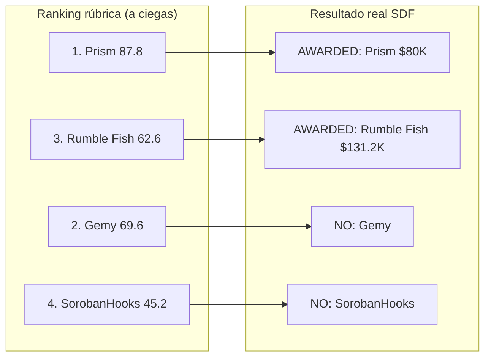

# SCF Round #41 — RFP Track "Soroban-first Block Explorer": análisis comparativo

> Análisis tipo jurado (a ciegas) de los proyectos que compitieron por el reto RFP **Soroban-first Block Explorer** en SCF #41, contrastado con el resultado real de la ronda (ya cerrada).

| Campo                           | Valor                                                                                                         |
| ------------------------------- | ------------------------------------------------------------------------------------------------------------- |
| Ronda                           | SCF #41 (estado: Ended; cerró 8-feb-2026; Q1 2026)                                                            |
| Rec-id de la ronda              | `recTLIVf9LOTBtkld`                                                                                           |
| Fecha del análisis              | 14-jun-2026                                                                                                   |
| Submissions totales en la ronda | 74                                                                                                            |
| Cluster Block Explorer          | 4 (3 dedicados + 1 multi-RFP)                                                                                 |
| Resultado real del RFP          | Financió 2 explorers: Prism ($80K) + Rumble Fish ($131.2K) = ~$211.2K                                         |
| Fuente primaria                 | communityfund.stellar.org + spec del RFP (rfp-track-q1-2026.md)                                               |
| Método de evaluación            | Verificación independiente de cada claim; puntuación **a ciegas** (sin conocer el resultado), luego contraste |

---

## 0. Metodología

Misma rúbrica del RFP Track que en análisis previos (6 dimensiones ponderadas; `Composite = suma(raw×peso)/57.5×100`; FUND ≥ 75, FUND WITH CONDITIONS 60–74, DO NOT FUND < 60). Las skills `scf-reviewer` y `scf-round-reviewer` se usaron como **referencia** (no ejecutables sin CSV de Airtable); el spec del RFP viene del markdown `rfp-track-q1-2026.md` aportado, ya que SCF #41 fue Q1 2026 y el Handbook ya no lista esos RFPs.

**Evaluación a ciegas.** Para que el contraste con el resultado real fuera honesto, cada proyecto se puntuó sin que el evaluador conociera quién fue financiado. Después se comparó la recomendación de la rúbrica contra el award real de SDF.

**Guardrails aplicados** (lecciones de análisis previos): no penalizar features ausentes del repo si están agendadas como tranches futuras (eso es lo que el grant paga); distinguir "descrito/agendado" de "afirmado como ya construido"; SCF paga 4 tranches (Tranche #0 = 10% al aceptar, luego 20/30/40), así que tranches de entrega que suman ~90% del headline es normal, no un gap; reservar "contradicho" para discrepancias reales claim-vs-realidad.

### Caveat de Fase 1

El sitio SCF no expone etiqueta legible de "a qué RFP pertenece" cada submission. La pertenencia al cluster se infirió del contenido. Tres proyectos son block explorers dedicados con targeting explícito; el cuarto (SorobanHooks) apunta a tres RFPs a la vez y se evalúa contra el spec del block explorer por decisión de alcance (penalizado por dedicarle solo ~1/3).

---

## 1. La especificación del RFP (Soroban-first Block Explorer)

Resumen parafraseado del spec Q1 2026:

**Scope.** Un block explorer que muestre transacciones de assets clásicos Y tokens Soroban en formato limpio y legible por humanos.

**Requisitos.** Implementación de referencia para mostrar SEP-41 y SEP-50; transacciones legibles por humanos; manejo completo de eventos CAP-67 exponiendo todo el stream unificado, con heurísticas para detectar swaps; despliegue de operaciones Soroban (ej. tanto "address C... llamó `swap`" como "C... cambió 1 USDC por 1 XLM en Soroswap"); filtrado por llamada a función de smart contract; soporte de SEP-39, SAC y assets clásicos; historial Soroban completo desde 2024 (protocolo v20+); open source.

**Criterios de evaluación que pesa SDF.** Capacidad técnica + experiencia relevante (idealmente haber construido/mantenido infra de block explorer en OTROS ecosistemas); experiencia manteniendo bases de datos grandes; alineación con el ecosistema; capacidad de entregar a tiempo; plan de lanzamiento coherente.

**Entregables esperados.** Frontend production-ready; documentación; auditoría + remediaciones; integraciones de ejemplo; load-testing (respuestas API estables <400ms bajo carga paralela).

Nota: el RFP enfatiza fuertemente **experiencia previa construyendo explorers en otros ecosistemas y manteniendo bases de datos grandes**. Esto resulta decisivo en el resultado real (ver §5).

---

## 2. Fase 1 — Identificación

| #   | Proyecto                              | Equipo                           | Solicitado | Awarded     | Targeting                  |
| --- | ------------------------------------- | -------------------------------- | ---------- | ----------- | -------------------------- |
| 1   | Prism: Soroban-First Block Explorer   | OBSRVR (Tillman Mosley III)      | $80.0K     | **$80.0K**  | Explícito                  |
| 2   | Soroban-First Block Explorer          | Rumble Fish Software Development | $131.2K    | **$131.2K** | Explícito                  |
| 3   | Soroban Block Explorer                | Gemy / NibrasD (solo)            | $75.0K     | $0          | Explícito                  |
| 4   | Prices & DeFi API with Block Explorer | SorobanHooks                     | $95.0K     | $0          | Multi-RFP (explorer = 1/3) |

**Conteo: 4 submissions tocan el RFP de block explorer. SDF financió 2** (Prism y Rumble Fish).

---

## 3. Fase 2 — Resumen por proyecto

**1. Prism / OBSRVR ($80K, awarded).** Extiende el block explorer "Terminal" existente de OBSRVR con capacidades Soroban completas: transacciones legibles, eventos CAP-67, historial desde génesis, interfaz unificada (clásico + SAC + SEP-39 + Soroban), streaming WebSocket en tiempo real y almacenamiento por capas (PostgreSQL hot + S3 Parquet/DuckDB cold), con heurísticas de detección de swaps (Soroswap, Aquarius, Phoenix). El equipo **mantiene stellarbeat/Radar** (el monitor de red/validadores de Stellar) y ya tiene un stack de ingestión de ledgers (nebu, flowctl). Es el caso con credenciales de infraestructura del ecosistema más fuertes y verificables.

**2. Rumble Fish ($131.2K, awarded).** Software house establecida (Cracovia, ~11-50 personas, cliente MakerDAO) con experiencia blockchain multi-cadena. Arquitectura AWS (ingestión, RDS PostgreSQL, NestJS API, React SPA via CloudFront), backfill histórico desde la activación de Soroban a fines de 2023, load-testing (1M baseline / 10M stress), auditoría OWASP Top 10. Su artefacto previo más relevante es un EVM debugger (decodificación legible de transacciones) en otro ecosistema. Es el ask más alto del cluster.

**3. Gemy / Soroban Block Explorer ($75K, no financiado).** Desarrollador solo que expande su "Stellar Transaction Visualizer" (ganador real de SCF #37, $50K) a un block explorer completo. La capa de visualización/decodificación ya funciona en vivo (decodifica `InvokeHostFunction`, nombres de función, args, state changes sobre mainnet hoy). Pide añadir indexación backend. Criterios de aceptación inusualmente rigurosos y medibles (p95 <400ms @ 500 VU, motor semántico ≥95% de precisión, backfill v20 sin gaps). El ask más bajo del cluster.

**4. SorobanHooks ($95K, no financiado).** Plataforma de webhooks/alertas Stellar/Soroban real y en vivo, que propone construir tres productos a la vez: Prices API (T1), DeFi Positions API (T2) y un block explorer (T3, solo ~$32K). Contra el RFP del block explorer, el explorer es la tranche más pequeña, última y menos detallada. Claims de tracción (100+ devs, 300+ tokens) no verificables fuera de un Drive privado; repos públicos delgados/vacíos, core cerrado.

---

## 4. Fase 3 — Evaluación tipo jurado (a ciegas)

### 4.1 Prism / OBSRVR — Composite 87.8 → FUND

**Verificación.** [VERIFICADO] Mantiene stellarbeat/Radar (radar.withobsrvr.com en vivo; monorepo con 59 PRs). [VERIFICADO] nebu, flowctl, ttp-processor-demo son repos Go reales y activos. [VERIFICADO] prism.withobsrvr.com carga como explorer funcional mostrando ledgers mainnet, clasificación de swaps, actividad de contratos; el código (`internal/{events,humanize,intent,gateway,search}`) mapea directo a los requisitos del RFP. [PARCIAL] "Terminal operacional en testnet" plausible pero sin instancia pública verificada; el demo en vivo mezcla ingestión real con algunos receipts mock (sin sobre-declaración: las features Soroban están agendadas como tranches, no afirmadas como hechas). [VERIFICADO] Arquitectura hot/cold sólida y alineada con el patrón Hubble/Galexie de SDF.

| Dimensión                  | Raw | Ponderado | Evidencia                                                                                                                                 |
| -------------------------- | --- | --------- | ----------------------------------------------------------------------------------------------------------------------------------------- |
| Spec Compliance (×3)       | 5   | 15.0      | El plan cubre todos los requisitos; el repo ya mapea CAP-67/humanize/intent.                                                              |
| Relevant Prior Work (×2.5) | 5   | 12.5      | Mantiene stellarbeat/Radar + stack de ingestión + explorer; exactamente lo que el RFP pide (infra de explorer + DBs grandes), verificado. |
| Developer Experience (×2)  | 4   | 8.0       | APIs JSON agent-friendly, docs site en vivo; docs específicas de Prism aún delgadas (deliverable T3).                                     |
| Maintenance Plan (×1.5)    | 4   | 6.0       | Infra post-launch financiada; track record de mantenimiento real (stellarbeat); riesgo de bus-factor de un solo mantenedor.               |
| Technical Approach (×1.5)  | 4   | 6.0       | Storage por capas probado; primitivas de ingestión ya existen; cifras de ahorro sin sustanciar.                                           |
| Budget & Timeline (×1)     | 3   | 3.0       | $80K bien itemizado; sin calendario explícito y full-history bajo una persona es agresivo.                                                |

**Recomendación: FUND.** Strength: track record verificado y raro (realmente mantiene stellarbeat/Radar y ya envió el stack que el RFP necesita). Concern: bus-factor de un solo mantenedor contra un alcance ambicioso sin calendario explícito.

### 4.2 Gemy / Soroban Block Explorer — Composite 69.6 → FUND WITH CONDITIONS

**Verificación.** [VERIFICADO] El "Stellar Transaction Visualizer" ganó SCF #37 ($50K) realmente. [VERIFICADO] stellarviz.xyz carga y decodifica transacciones Soroban en mainnet hoy (probado con un hash real: decodificó `InvokeHostFunction`, función `plant`, args, return, state changes). [PARCIAL] "Lo más difícil ya está construido" sobrevende: la capa de display sí funciona, pero el repo tiene 8 commits, sin tests, sin licencia (MIT prometida en T3); el visualizador NO es un indexer. [NO VERIFICADO] Identidad "Gemy"/NibrasD y experiencia con bases de datos grandes / explorers en otros ecosistemas, los dos criterios que el RFP prioriza. [VERIFICADO] Criterios de aceptación excepcionalmente rigurosos y medibles (señal positiva de seriedad).

| Dimensión                  | Raw | Ponderado | Evidencia                                                                                                                                                          |
| -------------------------- | --- | --------- | ------------------------------------------------------------------------------------------------------------------------------------------------------------------ |
| Spec Compliance (×3)       | 4   | 12.0      | Plan cubre SEP-41/50/SAC, CAP-67, filtrado fn-call, backfill v20, MIT; decodificación ya probada en vivo.                                                          |
| Relevant Prior Work (×2.5) | 3   | 7.5       | Award real de SCF #37 + decoder en vivo, pero es una SPA de viz, no infra de indexer; sin experiencia demostrada en DBs grandes ni explorers en otros ecosistemas. |
| Developer Experience (×2)  | 3   | 6.0       | Paquete npm + widget + UI en vivo; repo sin tests ni licencia aún.                                                                                                 |
| Maintenance Plan (×1.5)    | 3   | 4.5       | T3 cubre hardening/docs/monitoring; dev solo, presupuesto AWS delgado.                                                                                             |
| Technical Approach (×1.5)  | 4   | 6.0       | Stack concreto y sensato (Galexie, PostgreSQL, CDK) con gates de aceptación medibles.                                                                              |
| Budget & Timeline (×1)     | 4   | 4.0       | El ask más bajo, desglose detallado y realista; riesgo de capacidad solo.                                                                                          |

**Recomendación: FUND WITH CONDITIONS.** Strength: lo más difícil de fingir es cierto y demostrable (award real + decoder en vivo que ya renderiza llamadas Soroban legibles + criterios de aceptación de primer nivel). Concern: brecha capacidad-vs-alcance (un dev solo sin track record de infra de explorer ni DBs grandes, justo lo que el RFP más pesa).

### 4.3 Rumble Fish — Composite 62.6 → FUND WITH CONDITIONS

**Verificación.** [VERIFICADO] Software house real y establecida (rumblefish.dev, cliente MakerDAO, multi-cadena EVM/XRPL/Solana/ZK). [VERIFICADO/PARCIAL] `evm-debugger` (público, TS, desde 2022) es el artefacto más relevante: decodificación legible de transacciones en otro ecosistema (pero es un debugger, no un explorer completo). [VERIFICADO] El repo `stellar-scf-submissions` contiene solo docs de diseño (esperable en etapa de propuesta). [PARCIAL] Existe un repo `soroban-block-explorer` (Rust) pero creado DESPUÉS de la submission (no cuenta como trabajo previo, pero corrobora capacidad de entrega). [VERIFICADO] "Marek Kowalski" = co-founder/CTO. [DISCREPANCIA] El resumen de la página SCF describe ingestión propia (Galexie ECS), pero el doc de arquitectura enlazado describe un facade sobre Horizon ("no corre un pipeline de indexación separado"); la arquitectura cambió a través de documentos. Horizon tiene cobertura Soroban/CAP-67 incompleta, lo que pone en riesgo los requisitos más duros del RFP. [CONCERN] Solo un técnico nombrado para el ask más alto ($131.2K), con su propio risk register admitiendo trabajo secuencial de un dev.

| Dimensión                  | Raw | Ponderado | Evidencia                                                                                                                                                                                                                           |
| -------------------------- | --- | --------- | ----------------------------------------------------------------------------------------------------------------------------------------------------------------------------------------------------------------------------------- |
| Spec Compliance (×3)       | 3   | 9.0       | Cubre clásico+Soroban y resúmenes legibles, pero el diseño basado en Horizon sub-sirve el stream CAP-67 completo, las heurísticas de swap, el filtrado por fn-call y el "historial completo desde 2024"; SEP-41/50/39 no nombrados. |
| Relevant Prior Work (×2.5) | 4   | 10.0      | Casa establecida, MakerDAO, multi-cadena; EVM debugger directamente relevante; pero sin infra de explorer completa previa.                                                                                                          |
| Developer Experience (×2)  | 3   | 6.0       | OpenAPI 3.0, contratos REST limpios, IaC; open source no comprometido explícitamente; self-hosting minado por acoplamiento a AWS-managed.                                                                                           |
| Maintenance Plan (×1.5)    | 3   | 4.5       | Monitoreo CloudWatch/X-Ray, 7 días post-launch; sostenibilidad post-grant no abordada; bus-factor de un dev.                                                                                                                        |
| Technical Approach (×1.5)  | 3   | 4.5       | Coherente y honesto en riesgos, pero dependencia de Horizon (su propio riesgo #3) y arquitectura que cambió dos veces.                                                                                                              |
| Budget & Timeline (×1)     | 2   | 2.0       | $131.2K es el ask más alto del cluster para un diseño facade-Horizon con efectivamente un dev secuencial; justificación débil vs un competidor de $80K.                                                                             |

**Recomendación: FUND WITH CONDITIONS.** Strength: firma legítima y experimentada con un artefacto directamente relevante (EVM tx-decoder) y una propuesta inusualmente detallada (specs por endpoint, estimaciones por día, risk register). Concern: la arquitectura documentada es un facade sobre Horizon (no el pipeline de ingestión propio que sugiere la página), lo que pone en riesgo los requisitos Soroban más duros, al ask más alto y con un equipo de un principal.

### 4.4 SorobanHooks — Composite 45.2 → DO NOT FUND (contra el RFP del block explorer)

**Verificación.** [PARCIAL] sorobanhooks.xyz es un producto de webhooks/alertas real y en vivo (no es un explorer ni una data-API). [CONTRADICHO] "github.com/sorobanhooks org con código sustancial": es una cuenta de usuario personal, 6 repos, el repo flagship vacío (solo README), core cerrado; sin código de explorer/prices/DeFi público. [NO VERIFICADO] "100+ devs", "300+ tokens", "2 partnerships": no aparecen en sitio/docs/X; solo en un Drive privado. [NO VERIFICADO] Vishal Patel / Aman Shah no se pudieron vincular públicamente a SorobanHooks. [CONCERN para este RFP] El explorer es $32K, última tranche, descrito en bullets sin arquitectura, diseño de indexación/DB, auditoría ni integraciones de ejemplo.

| Dimensión                  | Raw | Ponderado | Evidencia                                                                                                                                             |
| -------------------------- | --- | --------- | ----------------------------------------------------------------------------------------------------------------------------------------------------- |
| Spec Compliance (×3)       | 2   | 6.0       | El explorer es ~1/3 del scope, última tranche; nombra los primitivos correctos pero sin arquitectura, diseño de DB, heurísticas de swap ni auditoría. |
| Relevant Prior Work (×2.5) | 2   | 5.0       | Producto real pero de webhooks/wallet SDKs; sin infra de explorer previa ni experiencia en DBs grandes; repos públicos delgados/vacíos.               |
| Developer Experience (×2)  | 3   | 6.0       | Existen docs de API + SDK, pero nada específico de explorer/data-API; open source solo en la tranche final.                                           |
| Maintenance Plan (×1.5)    | 2   | 3.0       | Servicios en vivo sugieren ops, pero sin plan de mantenimiento/SLA ni escalado de DB para el explorer.                                                |
| Technical Approach (×1.5)  | 2   | 3.0       | CAP-67 + historial v20 completo es un problema de indexación serio tratado superficialmente.                                                          |
| Budget & Timeline (×1)     | 3   | 3.0       | $32K para explorer + auditoría + load-testing es ligero; ser la última tranche = mayor riesgo de entrega.                                             |

**Recomendación: DO NOT FUND (para el RFP del block explorer).** Strength: producto Stellar/Soroban real y en vivo (no vaporware); el explorer está honestamente agendado, no falsamente afirmado. Concern: contra el spec del explorer, el deliverable es delgado y último (~$32K de $95K), sin track record de explorer ni DBs grandes, con core cerrado y repos públicos vacíos.

---

## 5. Fase 4 — Comparación y contraste con el resultado real

### Tabla comparativa (criterios × funding × resultado)

| Proyecto           | Ask     | Spec ×3 | Prior ×2.5 | DevEx ×2 | Maint ×1.5 | Tech ×1.5 | Budget ×1 | Composite | Recom. jurado | Resultado real         |
| ------------------ | ------- | :-----: | :--------: | :------: | :--------: | :-------: | :-------: | :-------: | ------------- | ---------------------- |
| **Prism (OBSRVR)** | $80K    |    5    |     5      |    4     |     4      |     4     |     3     | **87.8**  | FUND          | **AWARDED $80K** ✅    |
| **Gemy**           | $75K    |    4    |     3      |    3     |     3      |     4     |     4     | **69.6**  | FWC           | NO financiado ❌       |
| **Rumble Fish**    | $131.2K |    3    |     4      |    3     |     3      |     3     |     2     | **62.6**  | FWC           | **AWARDED $131.2K** ❌ |
| **SorobanHooks**   | $95K    |    2    |     2      |    3     |     2      |     2     |     3     | **45.2**  | DNF           | NO financiado ✅       |

### Jurado a ciegas vs. decisión real de SDF

### Síntesis: por qué la rúbrica acertó los extremos pero invirtió el medio

La evaluación a ciegas coincidió con SDF en los extremos: **Prism** (el único con infraestructura de ecosistema verificada y operativa) fue el claro #1 y fue financiado; **SorobanHooks** (explorer delgado dentro de una apuesta de data-API, con tracción no verificable) fue el claro último y no se financió. Hasta aquí, rúbrica y realidad coinciden.

La divergencia está en el medio, y es instructiva. La rúbrica puso a **Gemy (69.6) por encima de Rumble Fish (62.6)**, premiando los criterios de aceptación rigurosos de Gemy, su ask más bajo, su decoder ya funcionando, y penalizando a Rumble Fish por la arquitectura facade-sobre-Horizon y el ask más alto. **SDF hizo lo contrario: financió a Rumble Fish y no a Gemy.**

¿Por qué? Porque el RFP de block explorer pesa explícitamente dos criterios que la rúbrica mecánica subestima: **"experiencia construyendo/manteniendo infra de block explorer en otros ecosistemas"** y **"experiencia manteniendo bases de datos grandes"**. Bajo esa óptica:

- **Rumble Fish** es una software house establecida con un equipo, cliente MakerDAO, y un EVM debugger real. Puede dotar de personal, entregar y mantener infraestructura grande. El riesgo es de diseño (corregible con condiciones), no de capacidad de ejecución.
- **Gemy** es un dev solo cuya obra verificable es una SPA de visualización client-side, sin experiencia demostrada en indexación a escala ni en mantener DBs grandes, justo la parte dura y no construida del RFP. Su propuesta es excelente en papel, pero el riesgo de capacidad-vs-alcance es exactamente lo que un panel orientado a infraestructura penaliza.

La lección: para RFPs de **infraestructura**, SDF parece priorizar "¿este equipo puede realmente entregar y mantener esto a escala?" por encima de "¿la propuesta es la más pulcra y barata?". La rúbrica mecánica, al ponderar Spec Compliance (×3) sobre Prior Work (×2.5), puede invertir ese orden cuando un solista escribe una propuesta impecable que su track record no respalda todavía. Otro patrón notable: **SDF financió dos explorers** (un mantenedor de infra nativo del ecosistema y una casa de software establecida), repartiendo el riesgo en lugar de apostar a uno solo.

---

## 6. Fuentes

Ronda: https://communityfund.stellar.org/awards/recTLIVf9LOTBtkld

| Proyecto       | Página SCF                                                      | Repo / sitio                                                                       |
| -------------- | --------------------------------------------------------------- | ---------------------------------------------------------------------------------- |
| Prism (OBSRVR) | https://communityfund.stellar.org/submissions/rec9LrTdf5QkebmWt | https://github.com/withObsrvr · https://prism.withobsrvr.com                       |
| Rumble Fish    | https://communityfund.stellar.org/submissions/recIEUbnDA95HE2Qn | https://github.com/rumblefishdev · https://www.rumblefish.dev                      |
| Gemy           | https://communityfund.stellar.org/submissions/rec0LML4ICL1nQqB8 | https://github.com/NibrasD/stellar-transaction-visualizer · https://stellarviz.xyz |
| SorobanHooks   | https://communityfund.stellar.org/submissions/rec5INTMTPBdNoQXp | https://github.com/sorobanhooks · https://sorobanhooks.xyz                         |

---

## 7. Gaps de verificación y limitaciones

- Pertenencia al RFP inferida del contenido (sin etiqueta pública). SorobanHooks es multi-RFP; evaluado contra el spec del explorer por decisión de alcance.
- Puntuación a ciegas: los puntajes 1-5 son juicios de revisor; los proyectos en banda media (Gemy 69.6, Rumble Fish 62.6) son sensibles a ±1 punto, lo que explica en parte la inversión vs. el resultado real.
- No se pudieron ejecutar headless todos los flujos en vivo; varias evaluaciones se apoyan en código de repo + sitio.
- Rumble Fish: la discrepancia de arquitectura (página SCF "Galexie ingestión" vs. doc enlazado "facade Horizon") puede reflejar evolución del diseño más que engaño; el repo de explorer (Rust) se creó post-submission y corrobora capacidad de entrega.
- Claims de tracción no confirmados: SorobanHooks (100+ devs / 300+ tokens, en Drive privado); identidad de "Gemy"/NibrasD; experiencia en DBs grandes de Gemy.
- El contraste "jurado vs. real" usa el award público de SDF; las razones internas de SDF no son públicas y se infieren de los criterios del RFP.
