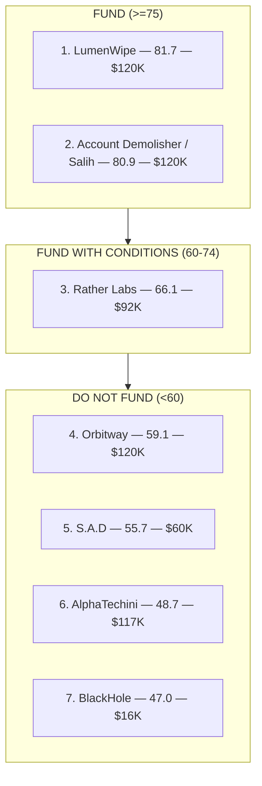

# SCF Round #44 — RFP Track "Account Demolisher": análisis comparativo

> Análisis tipo jurado de los proyectos que compiten por el reto RFP **Account Demolisher** en la ronda SCF #44 del Stellar Community Fund.

| Campo                                      | Valor                                                                                 |
| ------------------------------------------ | ------------------------------------------------------------------------------------- |
| Ronda                                      | SCF #44 (estado: **Panel Review**; deadline 14-jun-2026 ya pasó; máximo $150K en XLM) |
| Rec-id de la ronda                         | `rec4FnYypcsKpBRB4`                                                                   |
| Fecha del análisis                         | Actualizado 16-jun-2026 (1ª versión 14-jun)                                           |
| Proyectos en el cluster Account Demolisher | **7** (1 nuevo desde el 14-jun)                                                       |
| Funding agregado solicitado                | **$645.0K**                                                                           |
| Estado de resultados                       | Sin awards aún (ronda en Panel Review; lista muestra solo los que pasaron pre-screen) |
| Fuente primaria                            | communityfund.stellar.org (datos en vivo) + SCF Handbook                              |
| Autor del análisis                         | Revisión asistida; verificación independiente de cada claim                           |

> **Actualización 16-jun-2026:** la ronda pasó a Panel Review tras el deadline. La lista pública ahora muestra solo las submissions que **pasaron el pre-screen** (116 de las ~127 originales). Los 6 proyectos del cluster original siguen presentes (todos pasaron el pre-screen) y apareció **un séptimo**: "Account Demolisher" por Salih Toruner ($120K), un solo desarrollador con grant SCF #29 previo y prototipo en testnet. Se evalúa abajo (§4.7) y entra al ranking en el #2, casi empatado con LumenWipe.

---

## 0. Metodología y honestidad sobre los datos

### Qué skills se usaron

- **`scf-reviewer` (SCF Build Award reviewer)**: usada **como referencia**. No es una skill ejecutable de forma autónoma; se leyó su `SKILL.md` para extraer el marco de evaluación, los pesos por track y los red flags. Aplicada manualmente.
- **`scf-round-reviewer` (review de ronda completa)**: usada **como referencia**. Requiere un export CSV de Airtable que no estaba disponible, así que **no se ejecutó su pipeline**; se leyó su `SKILL.md` para extraer la rúbrica del RFP Track (6 dimensiones ponderadas, fórmula de composite y umbrales de recomendación) y se aplicó manualmente.
- **`scf-round-watcher`**: usada **como referencia operativa** para la mecánica de fetch en vivo de communityfund.stellar.org. La identificación de submissions se hizo navegando el sitio directamente (es una SPA React; los datos se cargaron vía navegador headless).
- **SCF Handbook (RFP Track)**: fuente oficial de la especificación del RFP Account Demolisher y de los criterios de jurado.

### Rúbrica aplicada (RFP Track)

Cada proyecto se puntúa 1 a 5 en seis dimensiones con pesos fijos:

| Dimensión                                             | Peso | Prioridad |
| ----------------------------------------------------- | ---- | --------- |
| Spec Compliance (cumplimiento de la spec del RFP)     | ×3   | Crítica   |
| Relevant Prior Work (experiencia previa relevante)    | ×2.5 | Alta      |
| Developer Experience (docs, SDK, setup, errores)      | ×2   | Alta      |
| Maintenance Plan (mantenimiento durante y post-grant) | ×1.5 | Media     |
| Technical Approach (arquitectura y seguridad)         | ×1.5 | Media     |
| Budget & Timeline (presupuesto y cronograma)          | ×1   | Baja      |

`Composite = (suma de raw×peso) / 57.5 × 100`. Umbrales: **FUND ≥ 75**, **FUND WITH CONDITIONS 60–74**, **DO NOT FUND < 60**.

### Caveat metodológico importante (léelo)

El sitio público de SCF **no expone una etiqueta legible por máquina de "a qué RFP pertenece" cada submission**. Todas las entradas de SCF #44 aparecen únicamente como "Build / Submitted", sin agrupación por RFP. Por lo tanto, la pertenencia al RFP Track "Account Demolisher" se **infirió del contenido de cada propuesta**, no de una etiqueta oficial. No puedo garantizar al 100% que la clasificación interna de SDF coincida con la mía, ni descartar que exista alguna submission con nombre distinto en otra parte de los 127 proyectos de la ronda. Por nombre y contenido, este es el cluster Account Demolisher.

Toda afirmación de cada propuesta (repos, demos, tracción, equipo, presupuesto) se verificó de forma independiente. Lo que no se pudo confirmar se marca explícitamente como **no verificado** en lugar de asumirlo.

---

## 1. La especificación del RFP (contra qué se mide "Spec Compliance")

Resumen parafraseado de la spec oficial del reto Account Demolisher (SCF Handbook):

**Problema.** Stellar tiene millones de cuentas, muchas abandonadas. Cerrar una cuenta limpiamente exige varios pasos manuales que la mayoría de usuarios no puede completar. Los exchanges no soportan `ACCOUNT_MERGE`, así que la reserva base (1 XLM) queda congelada en el ledger.

**Entregables requeridos.** Frontend web production-ready; integración backend con APIs de posiciones DeFi; documentación y suite de tests; auditoría de seguridad y remediación; remoción de trustlines; remoción de data entries; ajuste del esquema de firmas; cierre de posiciones abiertas (ofertas DEX, stakes en LP, posiciones DeFi); manejo de cuentas multisig; soporte de assets clásicos y Soroban; routing y conversión de tokens a XLM; merge de la cuenta al destino; firma client-side sin manejo custodial de llaves.

**Restricciones técnicas.** Operaciones clásicas + protocolos DeFi de Soroban; implementación no custodial (llaves del lado del cliente); integración con stellar-wallets-kit o input directo de secret key; diseño de minimización de confianza con flujos de confirmación y modos preview; open source con licencia permisiva.

**Criterios de éxito que pesa SDF.** Experiencia demostrada con operaciones clásicas y Soroban; historial sólido de seguridad; reputación en el ecosistema (equipo reconocido); plan de integración claro (UI standalone, integración con wallet, o partnership con CEX); UX production-grade apta para acciones irreversibles.

---

## 2. Fase 1 — Identificación de proyectos

Seis proyectos forman el cluster Account Demolisher en SCF #44:

| #   | Proyecto (título)                      | Equipo / by-line                                     | Funding | Señal de targeting al RFP                                                 | Rec-id              |
| --- | -------------------------------------- | ---------------------------------------------------- | ------- | ------------------------------------------------------------------------- | ------------------- |
| 1   | LumenWipe – Account Demolisher         | LumenWipe                                            | $120.0K | Explícita: "responds to the Account Demolisher RFP"                       | `recuKWaSdUL8Lkw9o` |
| 2   | Stellar Account Demolisher             | AlphaTechini (Rehoboth Okoibu)                       | $117.0K | Explícita: "in response to an official RFP"                               | `rect9rVnOcTCWyUGk` |
| 3   | Reliable tool to wipe an account       | Rather Labs                                          | $92.0K  | Implícita: rol de equipo "RFP requirements compliance"                    | `recY6KLjvnveEB9m2` |
| 4   | S.A.D – Stellar Account Demolisher     | 3000 Labs (equipo de Latch)                          | $60.0K  | Explícita: "public RFP-facing product"                                    | `recoqecNmsNZ9cjj5` |
| 5   | Stellar Wallet Demolisher (BlackHole)  | Action Account Demolisher (Jose Urquiza)             | $16.0K  | Implícita: "required by the official RFP guidelines"                      | `recD9LdHbtPhADPlp` |
| 6   | Stellar Account Checkup & Cleanup Tool | Orbitway / DAN Labs                                  | $120.0K | Inferida: repo llamado `account_demolisher`; no nombra el RFP en el texto | `recgbw9YPOLmiZFLA` |
| 7   | Account Demolisher _(nuevo 16-jun)_    | Salih Toruner (solo; `bytemaster333`; grant SCF #29) | $120.0K | Explícita                                                                 | `recqvIs2iRu34ESGo` |

**Conteo total confirmado: 7 proyectos (ronda en Panel Review). Funding agregado: $645.0K.**

El #7 (Salih Toruner) comparte by-line "Account Demolisher" con el #2 (AlphaTechini), pero son equipos y rec-ids distintos: Salih = `recqvIs2iRu34ESGo`, github `bytemaster333`, grant SCF #29 previo; AlphaTechini = `rect9rVnOcTCWyUGk`, github `AlphaTechini`. No confundir.

Nota sobre Orbitway: es el único que no menciona el RFP ni la frase "account demolisher" en el cuerpo de la propuesta (se enmarca como "checkup/cleanup/safe-exit"), pero su repositorio se llama literalmente `account_demolisher` y construye la spec exacta. Por decisión explícita, se incluye en el cluster sin distinción.

---

## 3. Fase 2 — Resumen por proyecto

**1. LumenWipe – Account Demolisher ($120.0K).** Herramienta no custodial que cierra cuentas Stellar de extremo a extremo (firmantes, data entries, ofertas, trustlines, claimable balances, posiciones DeFi), convierte residuos a XLM y hace merge al destino, incluyendo merges seguros a exchange vía un mediador compartido en una sola transacción atómica. Ya tiene un MVP clásico vivo en mainnet con prueba on-chain. El grant financia paridad Soroban + DeFi (Blend, Aquarius, Soroswap, Phoenix, FxDAO), API REST + SDK de TypeScript y hardening de producción. Es la propuesta con mayor tracción real verificable del cluster.

**2. Stellar Account Demolisher / AlphaTechini ($117.0K).** Propuesta para purgar "cuentas zombie" con recuperación automática desde Soroban (Soroswap, Blend, Aquarius), dashboard no custodial, previews pre-borrado y puente de depósito para CEX. Stack SvelteKit + backend Go + QuickNode RPC. El plan técnico es coherente, pero la ejecución es prácticamente inexistente: el repo es un único README y la "demo" es un sitio de documentación, no una app funcional. Equipo de 2 personas, solo una nombrada, sin track record verificable en Stellar.

**3. Reliable tool to wipe an account / Rather Labs ($92.0K).** Herramienta no custodial para cerrar cuentas clásicas + Soroban en un flujo guiado; lee estado clásico vía Horizon y Soroban vía RPC. Rather Labs es una agencia blockchain real y reputada (Clutch 4.9/5, clientes de $250K+). El documento de arquitectura es el artefacto más fuerte de toda la ronda y demuestra dominio correcto de los invariantes de merge en Stellar. El problema: toda la tracción es a nivel de agencia y en cadenas no-Stellar (MultiversX, Bittensor); no hay producto Stellar enviado, no hay repo público del producto, y la credencial estrella (SCF #41) no se pudo verificar. Presupuesto sin desglose por tranche.

**4. S.A.D – Stellar Account Demolisher / 3000 Labs ($60.0K).** Stack de infraestructura open source de migración, limpieza y cierre de cuentas, con SDK que devuelve XDR sin firmar y app web. Reutiliza la base del demolisher de StellarExpert. El repo (≈9 días de antigüedad, co-autoría con IA) implementa por ahora el camino clásico (ofertas, data entries, trustlines, venta de assets, merge con mediador); Soroban, DeFi/LP, conversión y tests están **agendados explícitamente como entregables de tranches futuras** (Deliverable 3 a 12 semanas), no presentados como ya hechos. El plan es honesto y completo; las dudas reales son de madurez (repo muy joven), factibilidad del alcance a $60K y el diferenciador "Latch", que no se pudo verificar.

**5. Stellar Wallet Demolisher (BlackHole) / Action ($16.0K).** Pipeline no custodial para desmantelar cuentas y recuperar capital varado, con auditoría de grafo de cuenta, liquidación vía path-payment y un motor "fail-safe" que secuencia hasta 95 operaciones. Desarrollador solo (Jose Urquiza, perfil EdTech). El sitio en vivo y los docs son sorprendentemente pulidos y muestran un modelo conceptual correcto, pero el repo es un scaffold de Vercel v0 de ~10 días (2 commits humanos), sin tests, sin licencia, README vacío. La parte dura (Soroban DeFi) es roadmap, sin historial Soroban que la respalde. El ask de $16K no cubre la auditoría externa que exige el RFP.

**6. Stellar Account Checkup & Cleanup Tool / Orbitway ($120.0K).** Infraestructura de "salud, limpieza y salida segura" de cuentas. Equipo real (DAN Labs / StreamNFT) pero nativo de EVM/Solana entrando por primera vez a Stellar. El MVP (≈1 mes) ya construye XDR client-side correcto para el teardown clásico y el merge, más escaneo read-only de Soroban/Blend. Las integraciones DeFi (Blend/Aquarius/Soroswap) están agendadas para M2 y no se reclaman como hechas. Las debilidades reales: reformula el RFP como "checkup" sin nombrarlo, difiere el multisig completo y el mediador a la última tranche (M3), no tiene tests aún, y exagera su credibilidad Stellar (LiquidSat ganó el buildathon de Core DAO/Bitcoin, no de Stellar; tracción de 10M+ tx es de productos no-Stellar).

**7. Account Demolisher / Salih Toruner ($120.0K, nuevo 16-jun).** Herramienta web no custodial que lleva una cuenta de cualquier estado al cierre limpio, clásico + Soroban, con unwinding DeFi en Blend, Aquarius, Soroswap y FxDAO. Backend delgado sin base de datos ni indexer (lee por Horizon + Soroban RPC, re-lee estado entre pasos). Desarrollador solo con grant SCF #29 previo verificado ($35K, Soroban Command Insights) y un **prototipo en testnet con código sustancial ya construido**: orquestador XState, los 4 adapters DeFi, multisig (vía Refractor), merge con mediador, y la **detección de posiciones por lectura directa de contratos**. Su arquitectura define una abstracción de proveedor DeFi de 3 tiers (Orion → OctoPos → lectura directa), pero **los tiers OctoPos/Orion no están vivos** (su propio doc dice que Orion "until the upstream API publishes" y OctoPos es mainnet-only); lo que realmente corre en testnet es la lectura directa. Debilidades: sin tests escritos aún (harness configurado), profundidad DeFi no probada contra mainnet, y bus-factor de un solo dev para un alcance clásico+Soroban+auditoría en 16 semanas.

---

## 4. Fase 3 — Evaluación tipo jurado SCF

Cada proyecto se evaluó con la rúbrica del RFP Track. Se listan hallazgos de verificación clave, el desglose de puntajes y la recomendación.

### 4.1 LumenWipe – Account Demolisher — Composite 81.7 → FUND

**Verificación.**

- [VERIFICADO] App en vivo (lumenwipe.com), no custodial, con integraciones de wallet y flujo de cierre completo.
- [VERIFICADO] Repo real y sustancial (Next.js 15, ~178 archivos TS/TSX, 63 commits, 16 tests unitarios + 3 specs Playwright); cuenta testnet con merges on-chain de junio 2026 consistentes con la tracción declarada.
- [VERIFICADO] Licencia Apache 2.0 presente en el repo (`LICENSE`, confirmado vía GitHub API: `spdx_id: Apache-2.0`). Cumple el requisito de licencia permisiva del RFP. (Nota: una revisión inicial la marcó ausente; el equipo la añadió y se reverificó.)
- [VERIFICADO] El presupuesto cuadra exacto. Las tres tranches por entregable (T1 $24K=20% + T2 $36K=30% + T3 $48K=40% = $108K) más la **Tranche #0 ($12K = 10%, pagada al aceptar el award)** suman $120K. Estructura conforme a la norma SCF (10/20/30/40); no hay gap. (Una revisión inicial leyó mal la estructura y reportó un "gap" inexistente.)
- [PARCIAL] Sebastian Salazar / Akkuea / Cougr confirmados como builders Stellar reales; la condición de "Stellar Fellow" es plausible pero no confirmada de forma independiente.
- [VERIFICADO] Miguel Nieto es two-time SCF Build Award recipient (Elixir Stellar SDK + Chaincerts, ambos proyectos SCF públicos e independientemente verificables). El LOI de Pollar está enlazado (Drive) en la propuesta. (Una revisión inicial los marcó como no verificados; confirmado.)

| Dimensión                  | Raw | Ponderado | Evidencia                                                                                                                                                                                                 |
| -------------------------- | --- | --------- | --------------------------------------------------------------------------------------------------------------------------------------------------------------------------------------------------------- |
| Spec Compliance (×3)       | 4   | 12.0      | Cubre casi todo el spec; licencia permisiva presente; la única brecha restante es la auditoría, que es trabajo financiado a futuro (no una falla). Defendible un 5 por el MVP en mainnet + plan completo. |
| Relevant Prior Work (×2.5) | 5   | 12.5      | Two-time SCF Build Award (Elixir Stellar SDK + Chaincerts) verificable + MVP en mainnet con merges on-chain + repos Stellar reales (Akkuea, Cougr). Track record probado de entrega en Stellar.           |
| Developer Experience (×2)  | 4   | 8.0       | Docs, plan determinístico, errores en lenguaje claro, tests; API/SDK aún en roadmap.                                                                                                                      |
| Maintenance Plan (×1.5)    | 3   | 4.5       | Open source y canales de comunidad; falta compromiso explícito de sostenibilidad post-grant.                                                                                                              |
| Technical Approach (×1.5)  | 4   | 6.0       | tx-builder puro y auditable, backend read-only, mediador para CEX; la llave de co-firma es una superficie de confianza no trivial.                                                                        |
| Budget & Timeline (×1)     | 4   | 4.0       | Desglose por deliverable dentro de cada tranche y split 20/30/40 conforme a la norma SCF (más Tranche #0 del 10%). Limpio y proporcional al alcance.                                                      |

**Recomendación: FUND.** Strength: track record probado (two-time SCF Build Award) + tracción real enviada y verificable (merges en mainnet), no un pitch deck. Concern: la auditoría de seguridad está planeada, no hecha (aunque es un entregable financiado de T3). Gaps de verificación: cifras exactas de mainnet (10+ cuentas / 100+ XLM).

> Nota de corrección (post-revisión inicial): tres objeciones que dejaban a LumenWipe en el borde resultaron resueltas/falsas/confirmadas. (1) La licencia Apache 2.0 ya está en el repo. (2) El supuesto gap presupuestal de $12K era la Tranche #0 del 10% que SCF paga al aceptar el award (estructura 10/20/30/40 del Handbook). (3) Las credenciales del equipo (two-time SCF Build Award de Miguel Nieto: Elixir Stellar SDK + Chaincerts; LOI de Pollar) quedaron confirmadas, subiendo Relevant Prior Work de 4 a 5. Composite ajustado de 75.7 (borderline) → 77.4 → **81.7 (FUND sólido)**.

### 4.2 Reliable tool to wipe an account / Rather Labs — Composite 66.1 → FUND WITH CONDITIONS

**Verificación.**

- [VERIFICADO] Rather Labs es una agencia blockchain real y reputada (fundada 2020, Buenos Aires; Clutch 4.9/5).
- [VERIFICADO] Documento de arquitectura accesible, detallado y correcto: identifica bien los invariantes (sponsorship bloquea merge, guard de posiciones DeFi no soportadas, orden de cierre). El mejor artefacto técnico de la ronda.
- [VERIFICADO pero NO Stellar] Hatom ($100M TVL) está en MultiversX; Membrane ($10B+ volumen) es multi-chain OTC. Nada de la tracción es Stellar.
- [NO VERIFICADO] La credencial "SCF #41, vault Soroban de $135K" no se pudo confirmar.
- [SEGURIDAD] El "key-injection proxy" tiene un nombre alarmante pero, según el doc, es stateless y keyless (solo inyecta un header de autorización para Soroswap); el riesgo real es el puente de exchange con keypair efímero.
- [HALLAZGO] No hay repo público del producto; la tracción es de agencia, no de producto.

| Dimensión                  | Raw | Ponderado | Evidencia                                                                                                                                               |
| -------------------------- | --- | --------- | ------------------------------------------------------------------------------------------------------------------------------------------------------- |
| Spec Compliance (×3)       | 4   | 12.0      | El doc de arquitectura cubre casi todo el spec; claimable balances marcado como "opcional" y la integración con API de posiciones DeFi no comprometida. |
| Relevant Prior Work (×2.5) | 3   | 7.5       | Credenciales de agencia fuertes pero todas off-Stellar; la única credencial Stellar no se verifica.                                                     |
| Developer Experience (×2)  | 3   | 6.0       | Doc claro y construible, historia de self-hosting buena; pero sin repo público, demo ni artefacto testnet evaluable.                                    |
| Maintenance Plan (×1.5)    | 3   | 4.5       | Open source y self-hosting que sobrevive si el equipo deja de operar; sin compromiso explícito post-grant.                                              |
| Technical Approach (×1.5)  | 4   | 6.0       | Sólido y consciente de la irreversibilidad; preocupa el puente efímero y la auditoría al final.                                                         |
| Budget & Timeline (×1)     | 2   | 2.0       | $92K razonable en absoluto pero **sin desglose por tranche**; imposible gate por milestone.                                                             |

**Recomendación: FUND WITH CONDITIONS.** Condiciones sugeridas: presupuesto itemizado por tranche; verificar o retirar la credencial SCF #41; renombrar/documentar el "key-injection proxy"; adelantar la auditoría; repo público al final de T1. Strength: agencia reputada + arquitectura excelente y audit-aware. Concern: talento general pero no probado en esta cadena ni en este producto, sin accountability financiero por milestone.

### 4.3 Stellar Account Checkup & Cleanup Tool / Orbitway — Composite 59.1 → DO NOT FUND (borderline)

**Verificación.**

- [VERIFICADO] Repo real, público, Apache-2.0, MVP sustancial (no skeleton): construye XDR client-side genuino para teardown clásico y merge; firma delegada a Wallets Kit.
- [OBSERVACIÓN, no contradicción] Blend/Aquarius/Soroswap están agendados como trabajo de **Tranche 2 (testnet)**, con lenguaje hedge ("supported Blend, Aquarius, Soroswap, or classic LP paths"; posiciones "classified as unsupported, visible-only, or executable"). No se afirman como ya integrados. El claim de MVP solo incluye "early Soroban allowance visibility", no integración DeFi. En el repo ya hay Blend parcialmente cableado, lo que va por delante de lo declarado, no por detrás. (Una revisión inicial marcó esto como "[CONTRADICHO]" por error.)
- [HALLAZGO] Sin suite de tests aún; los tests amplios están agendados a M3. El RFP pide tests, así que es una brecha de madurez, no una sobre-declaración.
- [HALLAZGO, no contradicción] El track record del equipo es EVM/SVM/Bitcoin y lo declaran con transparencia ("across EVM, SVM, Bitcoin, and Stellar-related ecosystems"; LiquidSat descrito como "Bitcoin-native", ganador del "Core Buildathon" de Core DAO). No inflan: el dato "10M+ tx / 120K+ cuentas" lo atribuyen a productos DAN cross-chain. La debilidad real es Prior Work: sin shipping previo en Stellar (primer commit Stellar ~mayo 2026) y el claim "worked on Soroban contracts / Stellar asset flows" es vago y no verificado.
- [VERIFICADO] No nombra el RFP en el cuerpo, pese a que el repo se llama `account_demolisher`.

| Dimensión                  | Raw | Ponderado | Evidencia                                                                                                                                                                                                                                                                                                                  |
| -------------------------- | --- | --------- | -------------------------------------------------------------------------------------------------------------------------------------------------------------------------------------------------------------------------------------------------------------------------------------------------------------------------- |
| Spec Compliance (×3)       | 4   | 12.0      | El diseño cubre el spec completo a lo largo de M1-M3 (Soroban/DeFi agendados en M2). Descuento de targeting (no llega a 5): el core (multisig completo + merge vía mediador) se difiere a la última tranche y la propuesta se enmarca como "checkup" sin nombrar el RFP. (Puntuado por diseño, no por el demo Blend-only.) |
| Relevant Prior Work (×2.5) | 2   | 5.0       | Builders creíbles pero EVM/Solana; cero shipping Stellar; credencial inflada.                                                                                                                                                                                                                                              |
| Developer Experience (×2)  | 3   | 6.0       | Monorepo limpio, Apache-2.0, README honesto; sin tests y app en vivo no verificable.                                                                                                                                                                                                                                       |
| Maintenance Plan (×1.5)    | 3   | 4.5       | Empresa establecida sugiere durabilidad; riesgo de chain-hopping.                                                                                                                                                                                                                                                          |
| Technical Approach (×1.5)  | 3   | 4.5       | Arquitectura sólida (builders XDR puros, backend read-only, RPC+Horizon); mediador y ejecución Soroban/DeFi aún no probados (agendados a M2/M3).                                                                                                                                                                           |
| Budget & Timeline (×1)     | 2   | 2.0       | $120K para equipo sin track record Stellar, con el entregable core en M3.                                                                                                                                                                                                                                                  |

**Recomendación: DO NOT FUND (borderline).** Strength: MVP real e inspeccionable que ya construye XDR correcto para el teardown clásico y el merge. Concern: equipo EVM/Solana sin historial Stellar probado (declarado con transparencia como cross-chain) pidiendo $120K con el entregable core (multisig + merge vía mediador) diferido a la última tranche, sin tests aún, y framing "checkup" que no nombra el RFP.

### 4.4 Stellar Wallet Demolisher (BlackHole) / Action — Composite 47.0 → DO NOT FUND

**Verificación.**

- [VERIFICADO] Repo existe; módulos `lib/stellar/` reales y uso de stellar-wallets-kit.
- [HALLAZGO] Repo de ~10 días, scaffold de Vercel v0 (32 de ~58 contribuciones por `v0agent`, solo 2 del autor humano), sin tests, sin licencia, README vacío, con partes significativas en mock/demo. Es inmadurez consistente con su propio "ready to build upon approval", no una afirmación falsa; pero significa que casi nada está construido.
- [VERIFICADO] "Hasta 95 operaciones" es técnicamente sano (bajo el límite de 100 ops/tx).
- [HALLAZGO] Sin historial Stellar/Soroban/blockchain hallable; la propuesta se apoya en su perfil EdTech/CTO. No es contradicción, pero los criterios de éxito del RFP de "security track record" y "reputación en el ecosistema" quedan sin evidencia.

| Dimensión                  | Raw | Ponderado | Evidencia                                                                                                                                                                                                                                                     |
| -------------------------- | --- | --------- | ------------------------------------------------------------------------------------------------------------------------------------------------------------------------------------------------------------------------------------------------------------- |
| Spec Compliance (×3)       | 3   | 9.0       | Los /docs son de calidad (arquitectura por capas, teardown canónico de 9 pasos, registro de adapters), y el diseño cubre buena parte del spec; algo más delgado que los líderes y la auditoría no cabe en $16K. (Puntuado por el doc, no por el scaffold v0.) |
| Relevant Prior Work (×2.5) | 1   | 2.5       | Sin historial Stellar/blockchain; repo de días, 2 commits humanos.                                                                                                                                                                                            |
| Developer Experience (×2)  | 3   | 6.0       | Sitio desplegado + docs sustanciales + módulos legibles; minado por README vacío y sin tests.                                                                                                                                                                 |
| Maintenance Plan (×1.5)    | 2   | 3.0       | Roadmap de 3 tranches sin itemizar; dev solo, sin co-mantenedores.                                                                                                                                                                                            |
| Technical Approach (×1.5)  | 3   | 4.5       | Instintos de arquitectura correctos; "keyless discovery" Soroban no probada; mucho es mock.                                                                                                                                                                   |
| Budget & Timeline (×1)     | 2   | 2.0       | $16K honesto pero implausible para clásico+Soroban+auditoría.                                                                                                                                                                                                 |

**Recomendación: DO NOT FUND.** Strength: UI no custodial realmente desplegada con docs de calidad y un modelo conceptual correcto del pipeline. Concern: casi nada construido (scaffold de v0 de ~10 días, sin tests ni licencia aún), un solo dev sin track record Stellar para de-riesgar el alcance Soroban, y un ask de $16K que no cubre la auditoría externa requerida por el RFP.

### 4.5 S.A.D – Stellar Account Demolisher / 3000 Labs — Composite 55.7 → DO NOT FUND

**Verificación.**

- [VERIFICADO] Repo existe (18 commits, ~9 días, varios `Co-Authored-By: Claude`); por ahora implementa el camino clásico (Horizon).
- [VERIFICADO] El plan agenda Soroban/DeFi como trabajo **futuro**, no lo presenta como hecho: "DELIVERABLE 3: SOROBAN, DEFI VISIBILITY... Estimated completion: 12 weeks after approval". La sección de tracción acota lo "ya construido" a lo clásico ("The current implementation already includes the **classic** account cleanup and mediator merge path"). No hay sobre-declaración.
- [VERIFICADO] Demo testnet en vivo con Freighter, scan completo y `accountMerge` confirmado (incluido co-firmado por mediador); fix de un bug de firma de Freighter (`tx_bad_auth`).
- [HALLAZGO] Sin suite de tests aún; los tests están agendados por tranche (apropiado para etapa pre-MVP, pero no hay evidencia todavía).
- [NO VERIFICADO] "Latch" (el diferenciador): sin listing en Chrome Web Store, npm ni footprint web independiente; solo un logo y la auto-descripción del README.

| Dimensión                  | Raw | Ponderado | Evidencia                                                                                                                                                                                                                                                                                                                           |
| -------------------------- | --- | --------- | ----------------------------------------------------------------------------------------------------------------------------------------------------------------------------------------------------------------------------------------------------------------------------------------------------------------------------------- |
| Spec Compliance (×3)       | 4   | 12.0      | El diseño aborda todos los entregables con un enfoque coherente (SDK + app, modos, mediador, Soroban/DeFi, conversión, multisig, tests, auditoría, Apache-2.0). La duda es de factibilidad/track record, no de cobertura. (Doc Notion no fetcheable; evaluado por el texto detallado de la propuesta, no por el demo clásico-only.) |
| Relevant Prior Work (×2.5) | 2   | 5.0       | Actividad GitHub real y bootcamp ZK; sin track record Stellar de producción; Latch no verificable.                                                                                                                                                                                                                                  |
| Developer Experience (×2)  | 2   | 4.0       | Landing en vivo y engine TS limpio; SDK aún no empaquetado y sin tests todavía.                                                                                                                                                                                                                                                     |
| Maintenance Plan (×1.5)    | 3   | 4.5       | Define plan de mantenimiento explícito (actualización de adaptadores, política de red, respuesta a bugs) y Apache-2.0.                                                                                                                                                                                                              |
| Technical Approach (×1.5)  | 3   | 4.5       | Arquitectura sólida: separación reversible/irreversible, modos, boundary del mediador, invalidación de planes obsoletos, simulación por RPC. Las partes duras aún no construidas pero sí descritas.                                                                                                                                 |
| Budget & Timeline (×1)     | 2   | 2.0       | $60K atractivo pero no itemizado por deliverable y ajustado para un alcance de 5 tranches + auditoría.                                                                                                                                                                                                                              |

**Recomendación: DO NOT FUND (borderline).** Strength: flujo de cierre clásico real y bien secuenciado, demo en vivo con merge confirmado, y un plan honesto y completo que cubre todo el spec. Concern: madurez (repo de días, asistido por IA, solo clásico hasta ahora), track record Stellar de producción ligero, y el diferenciador (Latch) no verificable; el ask de $60K para 5 tranches + auditoría es optimista. No funde por inmadurez/factibilidad, no por deshonestidad.

### 4.6 Stellar Account Demolisher / AlphaTechini — Composite 48.7 → DO NOT FUND

**Verificación.**

- [HALLAZGO] El repo `Stellar-Account-Demolisher` tiene 2 commits y contiene **solo un README** (7.6 KB); sin backend Go, sin frontend SvelteKit, sin tests. La propuesta SCF agenda todo por tranches (no reclama estar construido), pero no hay implementación que valide el plan ni la capacidad del equipo. (Nota: el README del repo se autodescribe "production-ready", lo cual sí choca con su contenido vacío.)
- [HALLAZGO] El enlace de "demo"/arquitectura es un sitio de documentación/spec, sin conexión de wallet, sin escaneo, sin funcionalidad: no existe app funcional todavía.
- [PARCIAL] El equipo no afirma ser "reconocido" (declaran presencia web mínima y verificación "vía repos open source"), pero esa verificación es débil: solo se nombra a un miembro (Rehoboth Okoibu, 1 follower) y los repos Stellar del perfil son forks de proyectos SCF/OnlyDust de otros, sin contribuciones merged evidentes.
- [VERIFICADO] El plan agenda Soroban/DeFi como trabajo futuro (Tranche 2: "SOROBAN MULTI-PROTOCOL DEFI POSITION DISSOLUTION MODULES", 30%), no lo presenta como ya hecho. La descripción en presente de "Products & Services" es spec de producto, no afirmación de completitud.
- [VERIFICADO] El presupuesto cuadra: tranches $23,400 (20%) + $35,100 (30%) + $46,800 (40%) = $105,300, más la Tranche #0 ($11,700 = 10%) = $117K. (Una revisión inicial lo marcó como "10% sin asignar"; era la Tranche #0 estándar de SCF.)
- [VERIFICADO] Tracción esencialmente nula.

| Dimensión                  | Raw | Ponderado | Evidencia                                                                                                                                                                                                                |
| -------------------------- | --- | --------- | ------------------------------------------------------------------------------------------------------------------------------------------------------------------------------------------------------------------------ |
| Spec Compliance (×3)       | 4   | 12.0      | El doc/plan es detallado y aborda todos los entregables del RFP con un enfoque correcto; la falta de ejecución y el equipo anónimo se penalizan en Prior Work, no aquí. (Puntuado por el diseño, no por el repo=README.) |
| Relevant Prior Work (×2.5) | 1   | 2.5       | Lead anónimo, sin reputación Stellar hallable; repos = forks de otros con 0 stars; cero implementación que valide capacidad.                                                                                             |
| Developer Experience (×2)  | 2   | 4.0       | README claro; sin código ejecutable, sin docs de setup, "demo" no funcional.                                                                                                                                             |
| Maintenance Plan (×1.5)    | 2   | 3.0       | Intención OSS y tranches; sin plan concreto de mantenimiento; riesgo de contribuidor único.                                                                                                                              |
| Technical Approach (×1.5)  | 3   | 4.5       | El enfoque es correcto y espeja un diseño conocido-bueno; sin validación de capacidad de ejecución.                                                                                                                      |
| Budget & Timeline (×1)     | 2   | 2.0       | Estructura de tranches correcta (suma $117K con la Tranche #0), pero el monto es alto para 2 personas con cero código construido.                                                                                        |

**Recomendación: DO NOT FUND.** Strength: un plan detallado y técnicamente correcto que mapea fielmente la arquitectura no custodial del RFP. Concern: nada está realmente construido (el repo es un README, la "demo" es una página de docs) bajo un equipo anónimo con un solo miembro nombrado y sin track record Stellar verificable, pidiendo $117K. No funde por ausencia total de ejecución y equipo no verificable, no por sobre-declaración.

### 4.7 Account Demolisher / Salih Toruner — Composite 80.9 → FUND _(nuevo)_

**Verificación.**

- [VERIFICADO] Repo `github.com/bytemaster333/account-demolisher` real y sustancial (TypeScript, Apache-2.0, ~20 commits en ~1 mes, arco coherente: helpers clásicos → wallet kit → soroban scval/sim → adapters Blend/Aquarius/Soroswap/FxDAO → plan tree + orquestador XState → multisig → safety). No es esqueleto.
- [VERIFICADO] Código clásico + Soroban real (no stubs): `orchestrator/machine.ts`, `classic-builder.ts`, `account-audit.ts`, adapters con `exit.ts` por protocolo, FxDAO con `prev-key.ts` (manejo real del linked-list de storage Soroban), módulos `soroban/` (allowances, sep41, scval, simulate). Commit "drop stub envelopes" marca el paso de placeholders a builders reales.
- [VERIFICADO] Demo en vivo (demolisher.saliht.xyz) corre el flujo client-side (connect → audit → plan → execute), multi-wallet + raw-key, allowlist de contratos, merge con mediador. El orquestador hace `horizon.submitTransaction` + `rpc.pollTransaction` reales (no solo simulación).
- [VERIFICADO] Grant SCF #29 previo (Soroban Command Insights, Activation Award $35K) confirmado en el recap de SCF #29; repos SCI en el perfil de bytemaster333. Track record Stellar real.
- [PARCIAL] "Full closure flow end-to-end en testnet": el path de código es real (submit+poll en vivo), pero no se ejecutó un cierre completo contra una cuenta financiada de forma independiente.
- [CONTRADICHO, menor] Harness de tests configurado (vitest/playwright/fast-check) pero **cero archivos de test commiteados**; los tests están agendados a T3, así que no es sobre-declaración, pero el repo hoy no tiene tests.

| Dimensión                  | Raw | Ponderado | Evidencia                                                                                                                                                                                                                                                                                                                                                   |
| -------------------------- | --- | --------- | ----------------------------------------------------------------------------------------------------------------------------------------------------------------------------------------------------------------------------------------------------------------------------------------------------------------------------------------------------------- |
| Spec Compliance (×3)       | 5   | 15.0      | Plan + prototipo cubren cada entregable requerido (trustlines, data, signers, multisig, offers, DeFi en 4 protocolos, Soroban+clásico, conversión, merge, mediador, firma client-side, Apache-2.0); sin gaps de spec.                                                                                                                                       |
| Relevant Prior Work (×2.5) | 4   | 10.0      | Grant SCF #29 verificado + código DeFi/Soroban real aquí + portafolio cross-chain; no es un nombre marquee del ecosistema, por eso no es 5.                                                                                                                                                                                                                 |
| Developer Experience (×2)  | 4   | 8.0       | Demo pública funcional, repo Next.js/TS limpio, wallet-kit; docs delgadas y sin tests commiteados aún.                                                                                                                                                                                                                                                      |
| Maintenance Plan (×1.5)    | 3   | 4.5       | Tranches implican hardening + docs + remediación de auditoría, Apache-2.0; sin compromiso explícito post-grant y bus-factor de un solo dev.                                                                                                                                                                                                                 |
| Technical Approach (×1.5)  | 4   | 6.0       | Diseño sólido: plan tree determinístico, orquestador XState con recovery, simulación primero, allowlist de contratos, detección por lectura directa de contratos (real en testnet). Define una cascada de proveedor de 3 tiers, pero OctoPos/Orion son interfaz pendiente (Orion sin publicar, OctoPos mainnet-only); adapters DeFi no probados en mainnet. |
| Budget & Timeline (×1)     | 3   | 3.0       | $120K/16 sem en solo, de MVP a mainnet auditada, coherente y gateado por tranches, pero ambicioso para una persona cubriendo 4 protocolos DeFi + tests adversariales + remediación de auditoría.                                                                                                                                                            |

**Recomendación: FUND.** Strength: prototipo en testnet desplegado que ya implementa casi toda la superficie del RFP (clásico + 4 protocolos DeFi + multisig + merge con mediador), respaldado por un grant SCF previo verificado; madurez rara para etapa de propuesta. Concern: dev solo cargando un alcance ambicioso de mainnet auditada en 16 semanas, con cero tests commiteados pese al harness; el riesgo se concentra en T2/T3.

---

## 5. Fase 4 — Comparación lado a lado

> **Nota de método (corrección 16-jun):** Spec Compliance y Technical Approach se puntúan desde el **doc de arquitectura** de cada submission (el diseño del producto final), no desde la madurez del demo/repo, porque lo implementado es solo un punto de partida en todos los proyectos. El demo/repo cuenta como evidencia de progreso (afecta DevEx/Maintenance levemente) y la capacidad de ejecución se mide en Relevant Prior Work (track record del equipo). Esto subió los Spec de varios competidores respecto a una versión previa que se apoyaba en el estado del código; el efecto neto: **los diseños convergen** (es un problema con una arquitectura conocida-buena que casi todos replican), así que el diferenciador real pasa a ser el **track record del equipo** y unas pocas decisiones de diseño distintivas. Los docs de arquitectura leídos: LumenWipe, Salih (Drive), Rather Labs (Google Doc), BlackHole (/docs), AlphaTechini (sitio docs); el de S.A.D (Notion) es JS-gated y no se pudo traer (su diseño se evaluó por el texto detallado de la propuesta).

### Tabla comparativa (proyectos × criterios × funding)

| Proyecto                               | Funding | Spec ×3 | Prior ×2.5 | DevEx ×2 | Maint ×1.5 | Tech ×1.5 | Budget ×1 | Composite | Recomendación            |
| -------------------------------------- | ------- | :-----: | :--------: | :------: | :--------: | :-------: | :-------: | :-------: | ------------------------ |
| **LumenWipe**                          | $120K   |    4    |     5      |    4     |     3      |     4     |     4     | **81.7**  | FUND                     |
| **Account Demolisher (Salih Toruner)** | $120K   |    5    |     4      |    4     |     3      |     4     |     3     | **80.9**  | FUND                     |
| **Rather Labs**                        | $92K    |    4    |     3      |    3     |     3      |     4     |     2     | **66.1**  | FUND WITH CONDITIONS     |
| **Orbitway**                           | $120K   |    4    |     2      |    3     |     3      |     3     |     2     | **59.1**  | DO NOT FUND (borderline) |
| **S.A.D**                              | $60K    |    4    |     2      |    2     |     3      |     3     |     2     | **55.7**  | DO NOT FUND (borderline) |
| **AlphaTechini**                       | $117K   |    4    |     1      |    2     |     2      |     3     |     2     | **48.7**  | DO NOT FUND              |
| **BlackHole**                          | $16K    |    3    |     1      |    3     |     2      |     3     |     2     | **47.0**  | DO NOT FUND              |

(Versiones previas de Orbitway/S.A.D/AlphaTechini/BlackHole eran 53.9/50.4/43.5/41.7; subieron al puntuar el diseño por el doc, no por el demo. El orden y los tiers no cambian: los cuatro siguen DNF por **track record de equipo** (Prior Work), no por el diseño.)

### Ranking y tiers

### Estado del DEMO/repo (no del diseño): qué hay construido hoy

> Esta tabla muestra el **punto de partida implementado**, no el diseño (el diseño está en los docs de arquitectura y, en casi todos, cubre el spec completo). Sirve para medir madurez/progreso, no para puntuar Spec Compliance.

| Capacidad del RFP                                 |           LumenWipe           |               Salih               |      Rather Labs      |        Orbitway         |        S.A.D         | AlphaTechini |         BlackHole          |
| ------------------------------------------------- | :---------------------------: | :-------------------------------: | :-------------------: | :---------------------: | :------------------: | :----------: | :------------------------: |
| Cierre clásico (trustlines, data, ofertas, merge) |     Construido (mainnet)      |       Construido (testnet)        |    Diseñado (doc)     |    Construido (XDR)     | Construido (testnet) | Solo README  |       Parcial (mock)       |
| Soroban + DeFi exits                              | En desarrollo (5 protocolos)  | Construido testnet (4 protocolos) |       Diseñado        |    Read-only (Blend)    |       Agendado       | Solo README  |          Roadmap           |
| Multisig                                          |              Sí               |          Sí (Refractor)           |          Sí           |      Diferido a M3      |     Solo lectura     | Solo README  |          Parsing           |
| Tests                                             |       Unit + Playwright       |         Harness sin tests         |      No público       |         Ninguno         |       Ninguno        |   Ninguno    |          Ninguno           |
| Tracción/track record                             | 2x SCF Build + merges mainnet |   Grant SCF #29 + demo testnet    | Agencia (off-Stellar) | Equipo EVM (no Stellar) |  Latch (no verif.)   |   Anónimo    | Solo dev (no track record) |

Nota: el diseño (doc de arquitectura) cubre el spec completo en LumenWipe, Salih, Rather Labs, Orbitway, S.A.D y AlphaTechini; BlackHole algo más delgado. La diferencia real está en la fila de track record, no en el diseño.

### Síntesis: cómo se ordenarían bajo la lógica de un jurado SCF

Al puntuar el **diseño desde los docs de arquitectura** (no desde el demo), aparece el hallazgo central: **los diseños convergen**. Account Demolisher es un problema con una arquitectura conocida-buena (backend delgado sin indexer, lectura por Horizon + Soroban RPC, re-lectura de estado entre pasos, simulación antes de firmar, proveedores DeFi pluggables, firma client-side no custodial, mediador compartido/por-deployment para exchanges). Casi todos los docs replican ese patrón y cubren el spec completo. Por eso Spec Compliance deja de separar a los proyectos, y el diferenciador real pasa a ser el **track record del equipo** (Relevant Prior Work) más unas pocas decisiones de diseño distintivas. El cluster se ordena en tres grupos:

**Fundables, casi empatados: LumenWipe (81.7) y Account Demolisher de Salih Toruner (80.9).** Los dos tienen diseño completo, track record Stellar verificable y un prototipo funcional. Se diferencian en los bordes:

- **LumenWipe** lidera por equipo (2 personas, two-time SCF Build Award de Miguel + Stellar Fellow/Akkuea/Cougr de Sebastian, tests escritos), por MVP en **mainnet**, y por dos diseños distintivos que Salih no tiene: **fees patrocinados CAP-15** (cierra cuentas que no pueden pagar su propia fee) y el **fast-path fusionado** (una sola firma para el caso común), más API REST + SDK y LOI de Pollar.
- **Salih** lidera en una cosa: ya tiene **más DeFi construido en testnet** — los 4 adapters de exit (Blend/Aquarius/Soroswap/FxDAO) y la **detección por lectura directa de contratos** funcionando, que en LumenWipe es trabajo a futuro. Matiz: los tiers OctoPos/Orion de su cascada **no están vivos** (Orion sin publicar, OctoPos mainnet-only), así que en ese punto específico ambos están empatados (interfaz pendiente de mainnet); su ventaja real es la lectura directa + los adapters construidos. Pero es **un solo dev sin tests** y con grant previo más chico (SCF #29 Activation, $35K, vs dos Build Awards).
- Net: LumenWipe arriba por equipo + edges de diseño + mainnet; Salih pisándole los talones por madurez de prototipo. Si SDF financia **dos** (como hizo en 4 de 6 RFPs de #41), ambos son candidatos plausibles.

**Fundable con condiciones: Rather Labs (66.1).** El mejor doc de arquitectura de la ronda, equipo agencia reputado, pero sin producto Stellar, con tracción off-Stellar, credencial SCF #41 no verificable y presupuesto sin desglose. Apuesta-al-equipo con gates.

**No fundables por track record (no por diseño): Orbitway (59.1), S.A.D (55.7), AlphaTechini (48.7), BlackHole (47.0).** Sus diseños cubren el spec (por eso subieron de la versión anterior), pero pierden en Relevant Prior Work: Orbitway = equipo EVM/Solana sin shipping Stellar + core diferido a M3; S.A.D = repo joven + diferenciador Latch no verificable; AlphaTechini = equipo anónimo sin capacidad verificable; BlackHole = solo dev sin track record + ask de $16K que no cubre la auditoría. La barra que no superan es "este equipo puede entregar y mantener esto", no "el diseño es bueno".

Notas que persisten: ninguna propuesta sobre-declaró Soroban/DeFi como ya construido (lo agendan como trabajo futuro, correcto para un RFP); y cuatro de los siete pidieron $117–120K, cerca del tope, con madurez muy dispar.

---

## 6. Fuentes (para verificación)

Página de la ronda: https://communityfund.stellar.org/awards/rec4FnYypcsKpBRB4
Spec del RFP: https://stellar.gitbook.io/scf-handbook/scf-awards/build-award/rfp-track

| Proyecto                           | Página SCF                                                      | Repo / sitio principal                                                                                  |
| ---------------------------------- | --------------------------------------------------------------- | ------------------------------------------------------------------------------------------------------- |
| LumenWipe                          | https://communityfund.stellar.org/submissions/recuKWaSdUL8Lkw9o | https://github.com/LumenWipe/lumenwipe · https://lumenwipe.com                                          |
| AlphaTechini                       | https://communityfund.stellar.org/submissions/rect9rVnOcTCWyUGk | https://github.com/AlphaTechini/Stellar-Account-Demolisher · https://account-demolisher-web.vercel.app/ |
| Rather Labs                        | https://communityfund.stellar.org/submissions/recY6KLjvnveEB9m2 | https://ratherlabs.com · https://github.com/rather-labs                                                 |
| S.A.D                              | https://communityfund.stellar.org/submissions/recoqecNmsNZ9cjj5 | https://github.com/FrankiePower/s-a-d · https://s-a-d.vercel.app/                                       |
| BlackHole                          | https://communityfund.stellar.org/submissions/recD9LdHbtPhADPlp | https://github.com/joseurquiza/stellar-blackhole · https://blackhole.action-tokens.com                  |
| Orbitway                           | https://communityfund.stellar.org/submissions/recgbw9YPOLmiZFLA | https://github.com/streamnft-tech/account_demolisher · https://orbitway.danlabs.xyz                     |
| Account Demolisher (Salih Toruner) | https://communityfund.stellar.org/submissions/recqvIs2iRu34ESGo | https://github.com/bytemaster333/account-demolisher · https://demolisher.saliht.xyz                     |

---

## 7. Gaps de verificación y limitaciones (declarados)

- Actualización 16-jun: ronda en **Panel Review** (deadline pasado, sin awards aún). La lista pública muestra solo los que pasaron pre-screen (116 de ~127). Cluster ahora **7** (entró Salih Toruner). No se puede descartar al 100% otra submission con nombre oblicuo, aunque el filtro de keywords fue amplio.
- **Método de scoring (corrección clave 16-jun):** Spec Compliance y Technical Approach se puntúan desde el **doc de arquitectura** (diseño del producto final), no desde la madurez del demo/repo (que es solo un punto de partida en todos). Esto subió los Spec de Orbitway/S.A.D/AlphaTechini/BlackHole respecto a la versión previa (53.9→59.1; 50.4→55.7; 43.5→48.7; 41.7→47.0). El orden y los tiers no cambian: siguen DNF por **track record de equipo** (Prior Work), no por diseño.
- Docs de arquitectura leídos: LumenWipe (architecture.md), Salih (Drive PDF), Rather Labs (Google Doc), BlackHole (/docs), AlphaTechini (sitio docs). **No leído: S.A.D (Notion JS-gated, no fetcheable)** — su diseño se evaluó por el texto detallado de la propuesta.
- El sitio SCF no expone etiqueta de RFP por submission; la pertenencia al cluster se infirió del contenido (ver §0). Orbitway no nombra el RFP en su texto.
- Los puntajes 1 a 5 son juicios de revisor; otro jurado podría variar en 1 punto. LumenWipe (81.7) y Salih (80.9) están casi empatados; los proyectos borderline (Orbitway 59.1) son sensibles a ±1 punto.
- Credenciales no confirmadas señaladas por proyecto: SCF #41 de Rather Labs; existencia del producto Latch (S.A.D); identidad del segundo miembro de AlphaTechini; LinkedIn/historial del dev de BlackHole. (LumenWipe: el two-time SCF Build Award de Miguel Nieto y el LOI de Pollar quedaron confirmados.)
- Corrección sobre presupuestos: lo que una revisión inicial reportó como "gap" en LumenWipe ($108K vs $120K) y en AlphaTechini ($105.3K vs $117K) **no es un gap**. SCF paga los Build Awards en 4 tranches (Handbook: Tranche #0 = 10% al aceptar el award, luego 20/30/40 por entregable). El 10% restante de cada propuesta es la Tranche #0. Ambos presupuestos suman el total exacto. Este hallazgo inicial era un error de lectura de la estructura SCF, ya corregido.
- Encuadre sobre Soroban/DeFi (aclaración metodológica): la **ausencia** de soporte Soroban/DeFi ya construido en los repos es la línea base esperada, porque construir eso es precisamente lo que la ronda busca financiar; por sí sola **no se penaliza**. Tras releer el texto verbatim de las propuestas, **ninguna afirmó tener Soroban/DeFi ya integrado**: tanto S.A.D como AlphaTechini lo agendan como entregables de tranches futuras (S.A.D en Deliverable 3 a 12 semanas; AlphaTechini en Tranche 2), y S.A.D acota lo "ya construido" a lo clásico de forma explícita. La acusación de "sobre-declaración" de una revisión inicial fue **incorrecta y se retiró**. En etapa de propuesta, Spec Compliance se evalúa por (1) si el diseño (doc) cubre el spec, (2) evidencia de capacidad de ejecución del equipo (track record) y (3) honestidad construido-vs-planeado, no por tener el trabajo futuro ya hecho.
- Snapshot al 16-jun-2026; las propuestas y repos pueden cambiar después. Como la ronda ya está en Panel Review tras el deadline, el set de submissions debería estar congelado salvo cambios administrativos.
